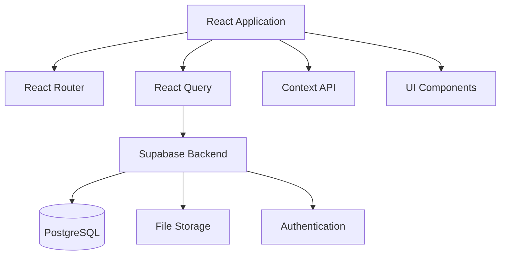
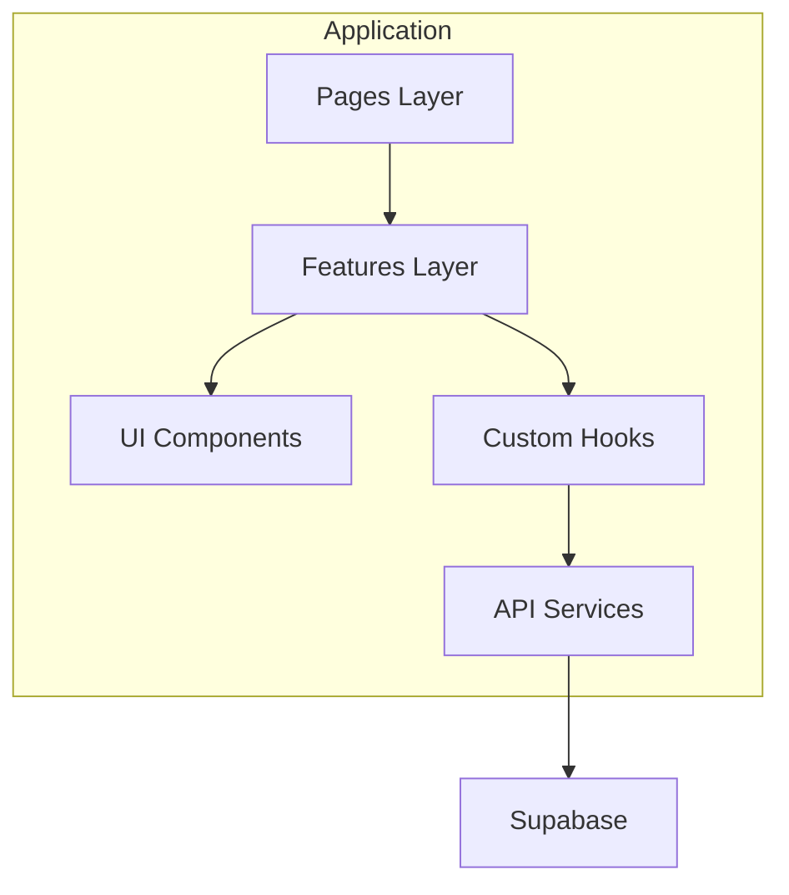
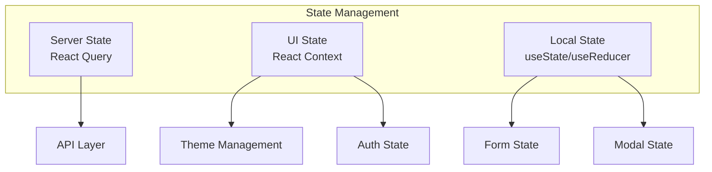
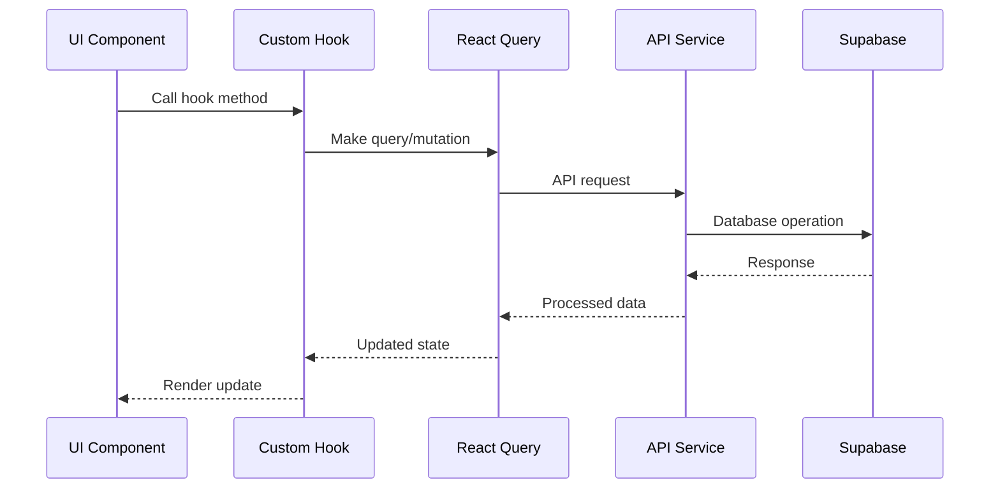
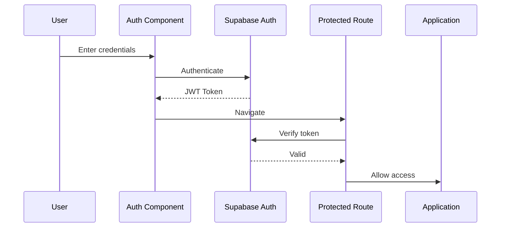

# The Wild Oasis - System Architecture

## High-Level Architecture

The Wild Oasis uses a modern client-side architecture with Supabase as the backend service. This document describes the system's architecture, components, and their interactions.



## Core Components

### 1. Frontend Architecture



#### Pages Layer
- **Dashboard** (`/pages/Dashboard.jsx`): Main analytics view
- **Bookings** (`/pages/Bookings.jsx`): Booking management
- **Cabins** (`/pages/Cabins.jsx`): Cabin inventory
- **Settings** (`/pages/Settings.jsx`): Application configuration

#### Features Layer
Each feature module is self-contained with its components and hooks:

```typescript
features/
├── authentication/         // User authentication
│   ├── LoginForm.jsx
│   ├── useLogin.js
│   └── useUser.js
├── bookings/             // Booking management
│   ├── BookingTable.jsx
│   ├── useBooking.js
│   └── useBookings.js
└── cabins/              // Cabin management
    ├── CabinTable.jsx
    ├── AddCabin.jsx
    └── useCabins.js
```

### 2. State Management Architecture



#### Server State Management
Using React Query for:
- Data fetching
- Caching
- Synchronization
- Error handling

Example:
```javascript
function useCabins() {
  return useQuery({
    queryKey: ['cabins'],
    queryFn: getCabins,
  });
}
```

#### Application State
Using Context API for:
- Theme management
- Authentication state
- Global settings

Example:
```javascript
const DarkModeContext = createContext();

function DarkModeProvider({ children }) {
  const [isDarkMode, setIsDarkMode] = useState(false);
  return (
    <DarkModeContext.Provider value={{ isDarkMode, setIsDarkMode }}>
      {children}
    </DarkModeContext.Provider>
  );
}
```

### 3. Component Communication



### 4. Authentication Flow



## Technical Implementation

### 1. Route Protection
```javascript
function ProtectedRoute({ children }) {
  const { isAuthenticated, isLoading } = useUser();
  
  if (isLoading) return <Spinner />;
  if (!isAuthenticated) return <Navigate to="/login" />;
  
  return children;
}
```

### 2. API Service Layer
```javascript
async function getCabins() {
  const { data, error } = await supabase
    .from('cabins')
    .select('*');
    
  if (error) throw new Error('Could not fetch cabins');
  return data;
}
```

### 3. Custom Hooks Pattern
```javascript
function useBookings() {
  const queryClient = useQueryClient();
  const { data, isLoading } = useQuery({
    queryKey: ['bookings'],
    queryFn: getBookings,
  });
  
  const { mutate: createBooking } = useMutation({
    mutationFn: createBookingApi,
    onSuccess: () => {
      queryClient.invalidateQueries(['bookings']);
      toast.success('Booking created!');
    },
  });
  
  return { bookings: data, isLoading, createBooking };
}
```

## Performance Considerations

### 1. Data Fetching Optimization
- Implements React Query for efficient caching
- Uses optimistic updates for better UX
- Implements infinite scrolling for large datasets

### 2. Component Optimization
```javascript
// Memoization example
const MemoizedCabinRow = memo(CabinRow, (prev, next) => {
  return prev.cabin.id === next.cabin.id;
});
```

### 3. Code Splitting
```javascript
// Route-based code splitting
const Dashboard = lazy(() => import('./pages/Dashboard'));
const Bookings = lazy(() => import('./pages/Bookings'));
```

## Security Measures

### 1. Authentication
- JWT-based authentication through Supabase
- Protected routes implementation
- Automatic token refresh

### 2. Data Access
- Row Level Security (RLS) in Supabase
- Role-based access control
- Input validation and sanitization

## Error Handling

```javascript
// Global error boundary
function ErrorFallback({ error }) {
  return (
    <div role="alert">
      <h2>Something went wrong!</h2>
      <pre>{error.message}</pre>
      <button onClick={() => window.location.assign('/')}>
        Refresh Application
      </button>
    </div>
  );
}
```

## Development Guidelines

### 1. Component Creation
- Follow atomic design principles
- Implement proper prop validation
- Write reusable components

### 2. State Management
- Use appropriate state management based on scope
- Implement proper caching strategies
- Follow React Query best practices

### 3. Testing Strategy
- Unit tests for business logic
- Integration tests for features
- End-to-end tests for critical flows

## Monitoring and Logging

### 1. Performance Monitoring
- React Query DevTools integration
- Performance profiling
- Error tracking

### 2. Application Logging
- Error logging
- User action tracking
- Performance metrics

---

This architecture documentation is maintained alongside the codebase. For specific implementation details, refer to the inline documentation in the source code.
