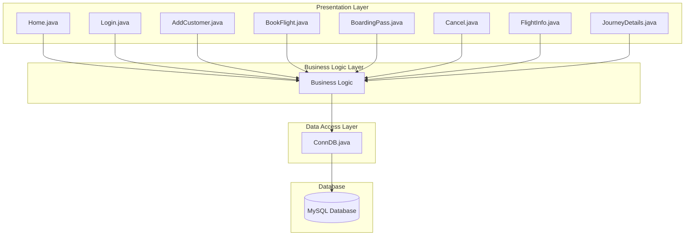
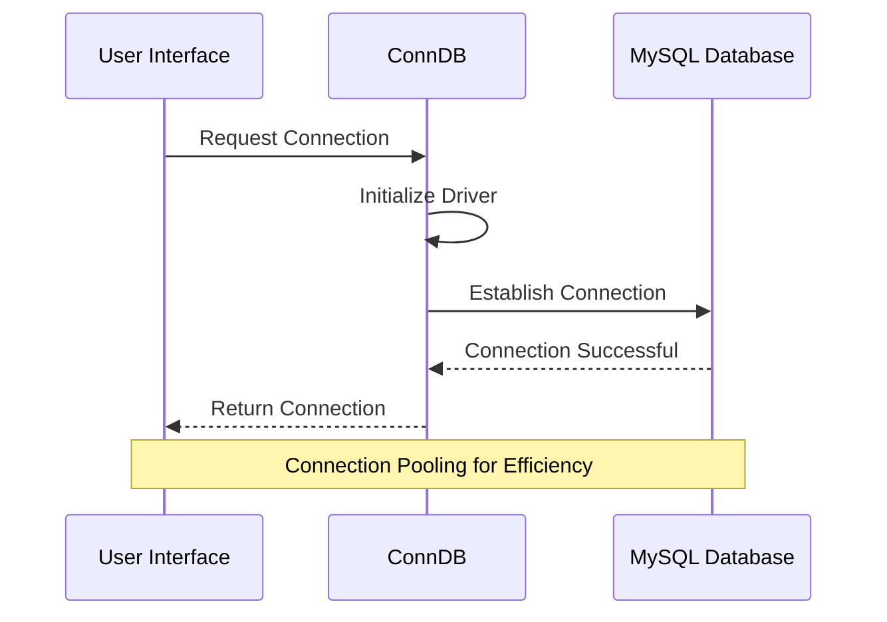
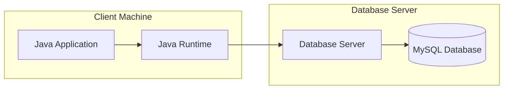

# Airline Management System - Architecture

## System Overview
The Airline Management System is built using a layered architecture pattern, separating the application into distinct layers for better maintainability and separation of concerns.

## Architectural Layers

### 1. Presentation Layer
Implemented using Java Swing for the graphical user interface, handling:
- User input processing
### 2. Business Logic Layer
Core classes managing business rules and operations:
- Flight booking logic
- Customer management
- Boarding pass generation
- Cancellation processing

### 3. Data Access Layer
Database interaction through JDBC:
- SQL query execution
- Connection management
- Data transformation
- Transaction handling

## Component Diagram

## Component Details

### 1. User Interface Components

#### Login System (`Login.java`)
- Handles user authentication
- Manages access control
- Session initialization

#### Dashboard (`Home.java`)
- Central navigation hub
- Quick access to main features
- System status overview

#### Customer Management (`AddCustomer.java`)
- Customer registration
- Profile management
- Data validation

#### Flight Operations
- `BookFlight.java`: Flight reservation
- `BoardingPass.java`: Travel document generation
- `Cancel.java`: Booking cancellation
- `FlightInfo.java`: Flight details and status
- `JourneyDetails.java`: Trip information

## Database Connection

### Connection Management (`ConnDB.java`)

## Error Handling
1. **User Interface Level**
   - Input validation
   - Form completion checks
   - User feedback messages

2. **Business Logic Level**
   - Business rule validation
   - Data consistency checks
   - Transaction management

3. **Database Level**
   - Connection error handling
   - Query error management
   - Data integrity checks

## Security Measures
1. **Authentication**
   - Login-based access control
   - Session management
   - Role-based permissions

2. **Data Security**
   - Secure database connections
   - Password encryption
   - Input validation

## Performance Considerations
1. **Database Optimization**
   - Connection pooling
   - Prepared statements
   - Query optimization

2. **UI Responsiveness**
   - Asynchronous operations
   - Efficient data loading
   - Resource management

## System Requirements
1. **Hardware Requirements**
   - Processor: 2.0 GHz or higher
   - RAM: 4GB minimum
   - Storage: 500MB free space

2. **Software Requirements**
   - Java Runtime Environment (JRE) 8+
   - MySQL Server 5.7+
   - Windows/Linux/macOS

## Deployment Architecture

## Scalability
The system is designed to handle:
- Multiple concurrent users
- Growing customer database
- Increased flight bookings
- Additional features

## Maintenance
Regular maintenance includes:
- Database backups
- System updates
- Performance monitoring
- Security patches
- Caching strategies
- Real-time updates
