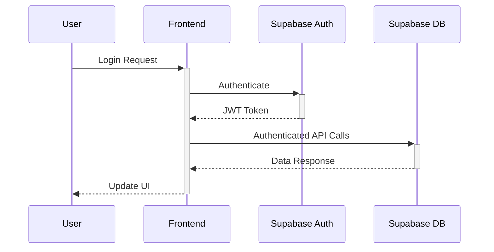
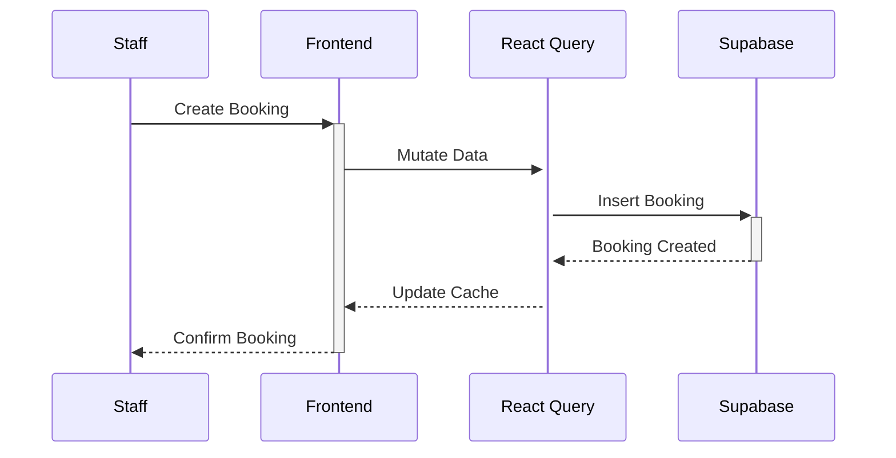

# System Architecture

## Overview
The Wild Oasis Hotel Management System follows a modern, component-based architecture built with React and Supabase. The system employs a client-side heavy approach where most of the business logic resides in the frontend, while leveraging Supabase's powerful backend services for data persistence, authentication, and real-time updates.

## Core Architecture Components

### 1. Frontend Architecture
The frontend is built with React 18 and follows a feature-based architecture pattern:

#### A. Core Layers
1. **Feature Layer** (`/features`)
   - Self-contained modules for each major feature
   - Includes components, hooks, and business logic
   - Examples: authentication, bookings, cabins

2. **UI Layer** (`/ui`)
   - Reusable UI components
   - Styled-components for consistent theming
   - Examples: Button, Modal, Form components

3. **Services Layer** (`/services`)
   - API integration with Supabase
   - Centralized data access
   - Authentication services

4. **Context Layer** (`/context`)
   - Global state management
   - Theme management (DarkMode)
   - User authentication state

#### B. Supporting Layers
1. **Hooks Layer** (`/hooks`)
   - Custom React hooks for shared logic
   - Examples: useOutsideClick, useLocalStorageState

2. **Utils Layer** (`/utils`)
   - Helper functions
   - Constants
   - Shared utilities

### 2. Backend Architecture (Supabase)
- **Authentication Service**: User management and authentication
- **Database Service**: PostgreSQL database for data storage
- **Storage Service**: File storage for cabin images
- **Real-time Service**: Live updates for booking status

## Data Flow Architecture

### 1. User Authentication Flow

### 2. Booking Management Flow

## State Management Architecture

### 1. Local State
- Component-level state using `useState`
- Form state using React Hook Form

### 2. Server State
- React Query for API data caching
- Optimistic updates for better UX
- Background data synchronization

### 3. Global State
- Dark mode preferences (Context API)
- User authentication state
- UI state (modals, notifications)

## Component Communication

### 1. Parent-Child Communication
- Props for passing data down
- Callback functions for events up

### 2. Cross-Component Communication
- Context API for global state
- Custom event bus for complex scenarios

### 3. Server Communication
- React Query for data fetching
- Supabase real-time subscriptions
- REST API calls via service layer

## Error Handling Architecture

### 1. Client-Side Error Handling
- Form validation (React Hook Form)
- API error handling (try-catch)
- Global error boundary

### 2. Server-Side Error Handling
- Supabase error responses
- Custom error messages
- Error logging

## Performance Optimizations

### 1. React Optimizations
- Lazy loading of components
- Memoization (useMemo, useCallback)
- Virtual scrolling for large lists

### 2. Data Optimizations
- React Query caching
- Optimistic updates
- Debounced API calls

## Security Architecture

### 1. Authentication
- JWT-based authentication
- Protected routes
- Role-based access control

### 2. Data Security
- HTTPS encryption
- Input sanitization
- API access control

## Deployment Architecture

### 1. Development Environment
- Vite dev server
- Hot module replacement
- Environment variables

### 2. Production Environment
- Static file hosting
- CDN distribution
- Environment configuration
