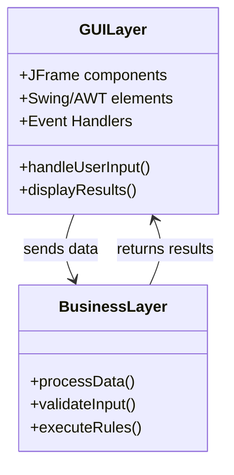
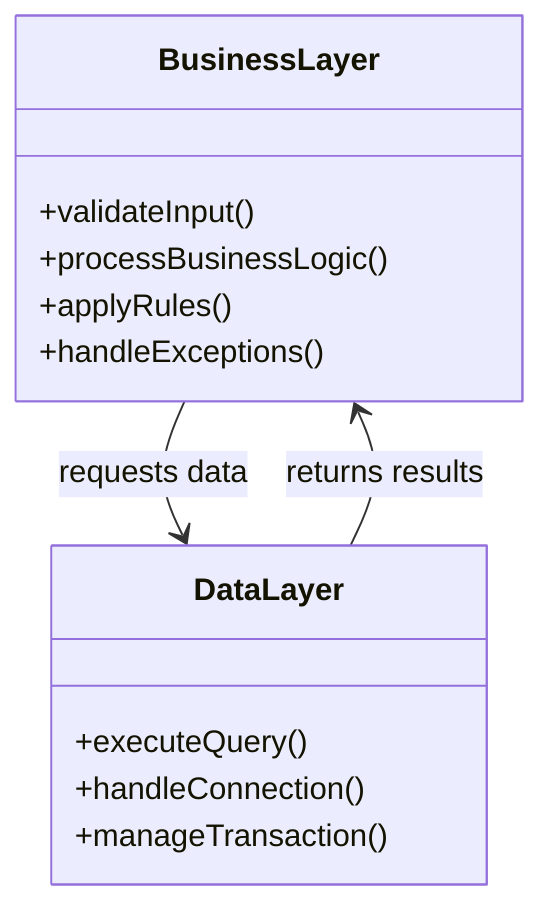
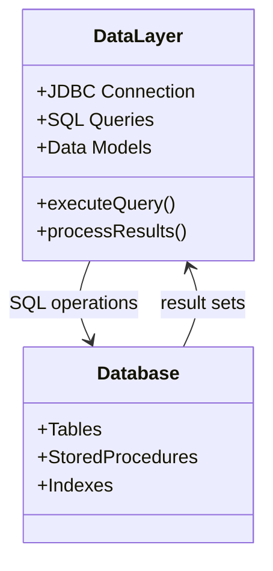
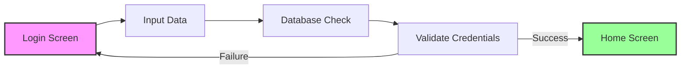
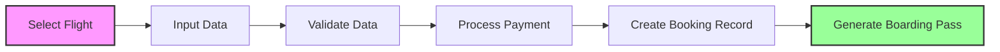

# System Architecture

## Overview
The Airline Management System follows a layered architecture pattern implemented as a Java desktop application. It uses the Swing framework for the user interface and integrates with a MySQL database for data persistence. The system is designed to be modular, maintainable, and scalable.

## Architectural Layers

### 1. Presentation Layer (GUI)

```mermaid
classDiagram
    class GUILayer {
        +JFrame components
        +Swing/AWT elements
        +Event Handlers
        +handleUserInput()
        +displayResults()
    }
    class BusinessLayer {
        +processData()
        +validateInput()
        +executeRules()
    }
    GUILayer --> BusinessLayer : sends data
    BusinessLayer --> GUILayer : returns results
```

Components:
- **Window Management**: JFrame-based windows
- **User Input**: Forms and controls
- **Event Handling**: ActionListener implementations
- **Data Display**: Tables and formatted output

Example (Login Window):
```java
public class Login extends JFrame implements ActionListener {
    private JTextField username;
    private JPasswordField password;
    
    public Login() {
        // GUI initialization
        setLayout(null);
        // Component setup
        username = new JTextField();
        password = new JPasswordField();
    }
    
    public void actionPerformed(ActionEvent ae) {
        // Event handling
        String user = username.getText();
        // Process login
    }
}
```

### 2. Business Logic Layer

```mermaid
classDiagram
    class BusinessLayer {
        +validateInput()
        +processBusinessLogic()
        +applyRules()
        +handleExceptions()
    }
    class DataLayer {
        +executeQuery()
        +handleConnection()
        +manageTransaction()
    }
    BusinessLayer --> DataLayer : requests data
    DataLayer --> BusinessLayer : returns results
```

Components:
- **Input Validation**
- **Business Rules**
- **Data Processing**
- **State Management**

Example (Booking Logic):
```java
public class BookFlight extends JFrame implements ActionListener {
    public void processBooking(String aadhar, String flightCode) {
        // Validate input
        if (!validateAadhar(aadhar)) {
            return;
        }
        
        // Process booking
        try {
            // Create reservation
            String pnr = generatePNR();
            // Save to database
        } catch (Exception e) {
            // Handle errors
        }
    }
}
```

### 3. Data Access Layer

```mermaid
classDiagram
    class DataLayer {
        +JDBC Connection
        +SQL Queries
        +Data Models
        +executeQuery()
        +processResults()
    }
    class Database {
        +Tables
        +StoredProcedures
        +Indexes
    }
    DataLayer --> Database : SQL operations
    Database --> DataLayer : result sets
```

Components:
- **Database Connection**: JDBC implementation
- **Query Execution**: SQL statements
- **Result Processing**: ResultSet handling
- **Transaction Management**

Example (Database Connection):
```java
public class ConnDB {
    Connection c;
    Statement s;
    
    public ConnDB() {
        try {
            Class.forName("com.mysql.cj.jdbc.Driver");
            c = DriverManager.getConnection("jdbc:mysql:///airline");
            s = c.createStatement();
        } catch(Exception e) {
            e.printStackTrace();
        }
    }
}
```

## System Flow Diagrams

### 1. User Authentication Flow

```mermaid
flowchart LR
    A[Login Screen] --> B[Input Data]
    B --> C[Database Check]
    C --> D[Validate Credentials]
    D -->|Success| E[Home Screen]
    D -->|Failure| A
    style A fill:#f9f,stroke:#333,stroke-width:2px
    style E fill:#9f9,stroke:#333,stroke-width:2px
```

### 2. Booking Process Flow

```mermaid
flowchart LR
    A[Select Flight] --> B[Input Data]
    B --> C[Validate Data]
    C --> D[Process Payment]
    D --> E[Create Booking Record]
    E --> F[Generate Boarding Pass]
    style A fill:#f9f,stroke:#333,stroke-width:2px
    style F fill:#9f9,stroke:#333,stroke-width:2px
```

## Design Patterns

### 1. Singleton Pattern (Database Connection)
```java
public class ConnDB {
    private static ConnDB instance;
    
    private ConnDB() {
        // Initialize connection
    }
    
    public static ConnDB getInstance() {
        if (instance == null) {
            instance = new ConnDB();
        }
        return instance;
    }
}
```

### 2. MVC Pattern
- **Model**: Database entities and data objects
- **View**: Swing GUI classes
- **Controller**: Event handlers and business logic

### 3. Observer Pattern
```java
// Subject (Observable)
ActionListener in GUI components

// Observer
public void actionPerformed(ActionEvent ae) {
    // Handle events
}
```

## Security Architecture

### 1. Authentication
- Password-based login
- Session management
- Role-based access

### 2. Data Security
- Input validation
- SQL injection prevention
- Error handling

Example:
```java
// Input Validation
private boolean validateInput(String input) {
    return input != null && !input.trim().isEmpty() 
           && !input.contains("'") && !input.contains(";");
}

// Prepared Statements
PreparedStatement ps = conn.prepareStatement(
    "SELECT * FROM users WHERE username = ? AND password = ?"
);
ps.setString(1, username);
ps.setString(2, password);
```

## Error Handling

### 1. Exception Management
```java
try {
    // Database operations
} catch (SQLException e) {
    JOptionPane.showMessageDialog(null, "Database Error: " + e.getMessage());
    logger.error("Database error", e);
} catch (Exception e) {
    JOptionPane.showMessageDialog(null, "System Error");
    logger.error("System error", e);
}
```

### 2. User Feedback
- Error dialogs
- Status messages
- Validation feedback

## Performance Considerations

### 1. Database Optimization
- Connection pooling
- Prepared statements
- Optimized queries

### 2. UI Responsiveness
- Background processing
- Efficient event handling
- Resource management

## Deployment Architecture

### 1. Application Components
```
+------------------+
|    Client App    |
|  (Java Desktop)  |
+------------------+
         ↓
+------------------+
|  MySQL Database  |
|    (Backend)     |
+------------------+
```

### 2. System Requirements
- JRE 8 or higher
- MySQL 5.7+
- Minimum 4GB RAM

## Terms and Definitions

- **JFrame**: Main window container in Java Swing
- **ActionListener**: Interface for handling user interactions
- **PreparedStatement**: Precompiled SQL statement
- **Connection Pooling**: Database connection reuse mechanism
- **JDBC**: Java Database Connectivity API
- **GUI**: Graphical User Interface
- **MVC**: Model-View-Controller pattern
- **Singleton**: Design pattern ensuring single instance
- **Exception Handling**: Error management mechanism
