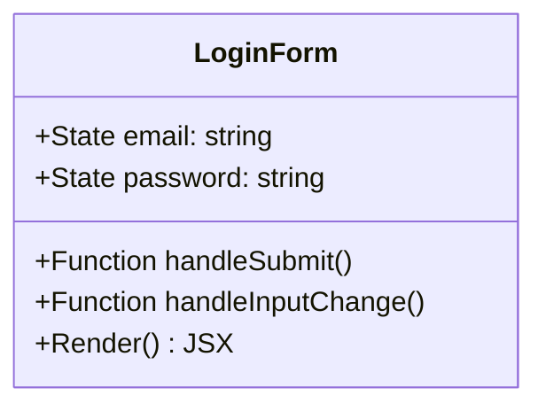
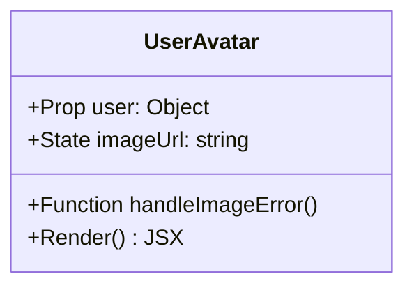
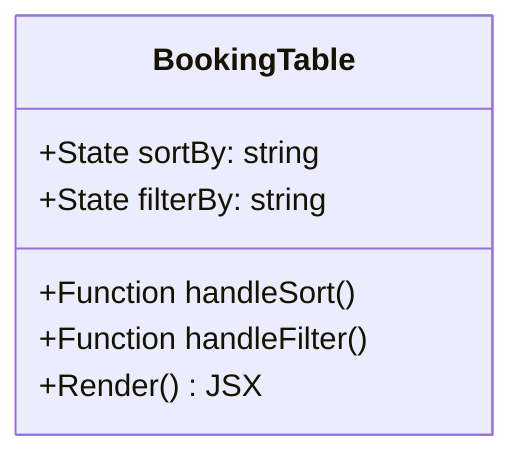
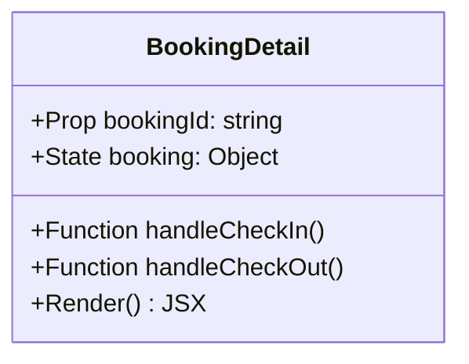
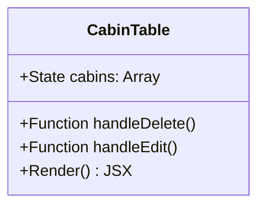
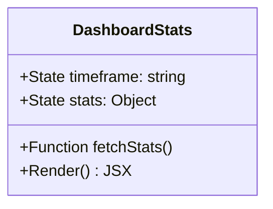
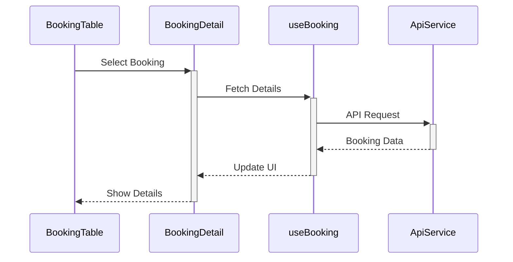
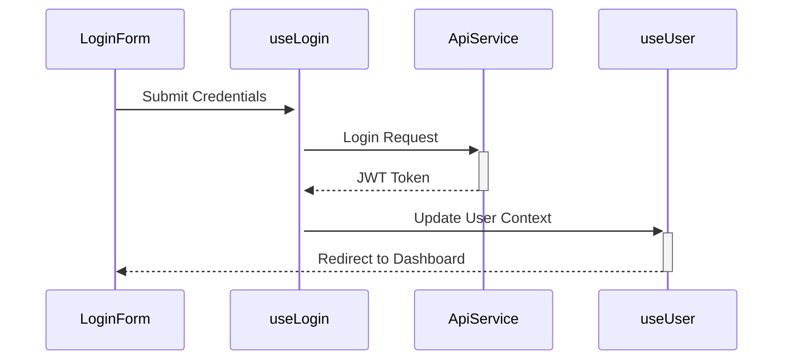

# Components and Hooks Documentation

## Core Components

### 1. Authentication Components

#### `LoginForm` Component
Location: `features/authentication/LoginForm.jsx`

**Purpose**: Handles user authentication with email/password login.
**Key Features**:
- Form validation
- Error handling
- Success notifications
- Protected route redirection

#### `UserAvatar` Component
Location: `features/authentication/UserAvatar.jsx`

**Purpose**: Displays user profile image with fallback.

### 2. Booking Management

#### `BookingTable` Component
Location: `features/bookings/BookingTable.jsx`

**Purpose**: Displays and manages booking records.
**Features**:
- Sorting by multiple fields
- Filtering capabilities
- Pagination
- Action buttons for each booking

#### `BookingDetail` Component
Location: `features/bookings/BookingDetail.jsx`

**Purpose**: Shows detailed booking information.

### 3. Cabin Management

#### `CabinTable` Component
Location: `features/cabins/CabinTable.jsx`

**Purpose**: Manages cabin listings.
**Features**:
- CRUD operations for cabins
- Image upload
- Price management
- Availability status

### 4. Dashboard Components

#### `DashboardStats` Component
Location: `features/dashboard/DashboardStats.jsx`

**Purpose**: Displays key performance metrics.

## Custom Hooks

### 1. Authentication Hooks

#### `useLogin` Hook
Location: `features/authentication/useLogin.js`
```javascript
const useLogin = () => {
  const { mutate: login, isLoading } = useMutation({
    mutationFn: ({ email, password }) => loginApi(email, password),
    onSuccess: (user) => {
      queryClient.setQueryData(['user'], user);
      navigate('/dashboard');
    },
  });
  
  return { login, isLoading };
};
```
**Purpose**: Manages login functionality with error handling.

#### `useUser` Hook
Location: `features/authentication/useUser.js`
```javascript
const useUser = () => {
  const { data: user, isLoading } = useQuery({
    queryKey: ['user'],
    queryFn: getCurrentUser,
  });
  
  return { user, isLoading, isAuthenticated: user?.role === 'authenticated' };
};
```
**Purpose**: Provides current user context throughout the app.

### 2. Booking Hooks

#### `useBookings` Hook
Location: `features/bookings/useBookings.js`
```javascript
const useBookings = ({ filter, sortBy, page }) => {
  const { data, isLoading } = useQuery({
    queryKey: ['bookings', filter, sortBy, page],
    queryFn: () => getBookings({ filter, sortBy, page }),
  });
  
  return { bookings: data?.data, count: data?.count, isLoading };
};
```
**Purpose**: Fetches and manages booking data with filtering and pagination.

### 3. UI Hooks

#### `useOutsideClick` Hook
Location: `hooks/useOutsideClick.js`
```javascript
const useOutsideClick = (handler, listenCapturing = true) => {
  const ref = useRef();

  useEffect(() => {
    function handleClick(e) {
      if (ref.current && !ref.current.contains(e.target)) {
        handler();
      }
    }

    document.addEventListener('click', handleClick, listenCapturing);
    return () => document.removeEventListener('click', handleClick, listenCapturing);
  }, [handler, listenCapturing]);

  return ref;
};
```
**Purpose**: Handles clicks outside a component, useful for modals and dropdowns.

## Utility Functions

### 1. Date Utilities
Location: `utils/helpers.js`
```javascript
export const formatDate = (date) => 
  new Intl.DateTimeFormat('en', {
    day: 'numeric',
    month: 'short',
    year: 'numeric',
  }).format(new Date(date));

export const subtractDates = (date1, date2) => 
  Math.round(Math.abs(date1 - date2) / (1000 * 60 * 60 * 24));
```

### 2. Currency Formatting
Location: `utils/helpers.js`
```javascript
export const formatCurrency = (value) => 
  new Intl.NumberFormat('en', {
    style: 'currency',
    currency: 'USD',
  }).format(value);
```

## Styled Components

### 1. Common UI Components

#### `Button` Component
Location: `ui/Button.jsx`
```javascript
const Button = styled.button`
  border: none;
  border-radius: var(--border-radius-sm);
  box-shadow: var(--shadow-sm);
  padding: 1.2rem 1.6rem;
  font-weight: 500;
  color: var(--color-brand-50);
  background-color: var(--color-brand-600);
  
  &:hover {
    background-color: var(--color-brand-700);
  }
`;
```

#### `Modal` Component
Location: `ui/Modal.jsx`
```javascript
const StyledModal = styled.div`
  position: fixed;
  top: 50%;
  left: 50%;
  transform: translate(-50%, -50%);
  background-color: var(--color-grey-0);
  border-radius: var(--border-radius-lg);
  box-shadow: var(--shadow-lg);
  padding: 3.2rem 4rem;
  transition: all 0.5s;
`;
```

## Component Interaction Examples

### 1. Booking Flow


### 2. Authentication Flow

