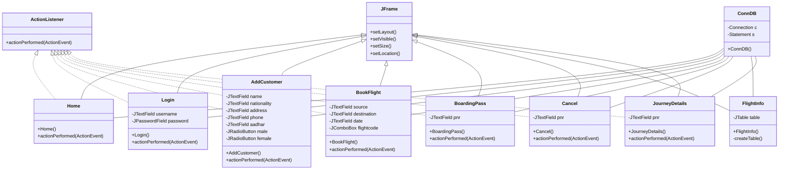

# Class Documentation

## Class Hierarchy


## Class Descriptions

### 1. ConnDB
**Purpose**: Database connection management class
- Establishes and manages MySQL database connections
- Provides connection and statement objects to other classes
- Implements singleton pattern for connection management

**Key Methods**:
```java
public ConnDB() {
    // Initializes database connection
    // Loads JDBC driver
    // Creates statement object
}
```

### 2. Home
**Purpose**: Main dashboard interface
- Provides navigation to all system features
- Centralizes access to different operations
- Implements menu-based navigation

**Key Features**:
- User interface components for all main functions
- Event handling for navigation
- Visual feedback for user actions

### 3. Login
**Purpose**: User authentication interface
- Handles user login process
- Validates credentials against database
- Manages access control

**Key Components**:
- Username and password fields
- Login button with validation
- Error handling for invalid credentials

### 4. AddCustomer
**Purpose**: Customer registration interface
- Collects and validates customer information
- Stores customer data in database
- Handles form validation

**Key Fields**:
```java
// Form Fields
JTextField name;        // Customer name
JTextField nationality; // Customer nationality
JTextField address;     // Customer address
JTextField phone;       // Contact number
JTextField aadhar;      // ID number
JRadioButton gender;    // Gender selection
```

### 5. BookFlight
**Purpose**: Flight booking interface
- Manages flight reservations
- Validates booking information
- Generates booking references

**Key Operations**:
- Flight search and selection
- Passenger information verification
- Booking confirmation
- PNR generation

### 6. BoardingPass
**Purpose**: Boarding pass generation
- Creates boarding passes for confirmed bookings
- Retrieves booking information
- Formats travel documents

**Key Features**:
- PNR validation
- Passenger details display
- Boarding pass printing

### 7. Cancel
**Purpose**: Booking cancellation interface
- Processes booking cancellations
- Updates reservation records
- Handles refund information

**Key Steps**:
1. PNR validation
2. Booking verification
3. Cancellation processing
4. Database update

### 8. FlightInfo
**Purpose**: Flight information display
- Shows available flights
- Displays flight schedules
- Presents pricing information

**Components**:
- JTable for flight listing
- Search and filter options
- Sorting capabilities

### 9. JourneyDetails
**Purpose**: Travel information interface
- Displays booking details
- Shows itinerary information
- Presents travel schedule

**Key Methods**:
```java
public void actionPerformed(ActionEvent ae) {
    // Handles user interactions
    // Retrieves journey information
    // Updates display
}
```

## Common Patterns

### 1. GUI Components
All interface classes:
- Extend `JFrame` for window management
- Implement `ActionListener` for event handling
- Use consistent layout patterns

### 2. Database Operations
Standard pattern for database operations:
```java
ConnDB conn = new ConnDB();
String query = "SELECT/INSERT/UPDATE...";
ResultSet rs = conn.s.executeQuery(query);
// Process results
```

### 3. Event Handling
Consistent event handling pattern:
```java
public void actionPerformed(ActionEvent ae) {
    if (ae.getSource() == buttonName) {
        // Handle specific button click
    }
}
```

## Best Practices

### 1. Error Handling
```java
try {
    // Database operation
} catch (Exception e) {
    e.printStackTrace();
    // User-friendly error message
}
```

### 2. Input Validation
```java
private boolean validateInput() {
    // Check required fields
    // Validate data formats
    // Return validation status
}
```

### 3. Resource Management
```java
// Proper resource cleanup
finally {
    if (rs != null) rs.close();
    if (stmt != null) stmt.close();
}
```

## Dependencies

### External Libraries
1. Java Swing (`javax.swing.*`)
   - GUI components
   - Event handling
   - Window management

2. MySQL Connector (`com.mysql.cj.jdbc.Driver`)
   - Database connectivity
   - Query execution
   - Result set handling

### Internal Dependencies
1. `ConnDB` used by all classes for database operations
2. Each form class depends on related database tables
3. Navigation flow between classes through event handling

### State Management

```plaintext
useLocalStorageState
├── Purpose: Persist state in localStorage
└── Usage: Dark mode, user preferences
```

### Navigation

```plaintext
useMoveBack
├── Purpose: Handle navigation history
└── Usage: Back button functionality
```

### UI Interaction

```plaintext
useOutsideClick
├── Purpose: Detect clicks outside elements
└── Usage: Modal closing, dropdown menus
```

## Plain English Explanations

### For Developers

1. **Component Organization**

   - Components are grouped by feature
   - Each feature has its own hooks and utilities
   - UI components are shared across features

2. **State Management**

   - Local state for component-specific data
   - Context for global state
   - Custom hooks for complex logic

3. **Data Flow**
   - Components use hooks for data operations
   - Services handle API communication
   - Context provides global state access

### For Non-Technical Users

1. **User Interface**

   - Clear navigation structure
   - Consistent design patterns
   - Intuitive form handling

2. **Features**

   - Straightforward booking management
   - Easy cabin administration
   - Simple user settings

3. **Data Handling**
   - Automatic data saving
   - Real-time updates
   - Secure information storage
