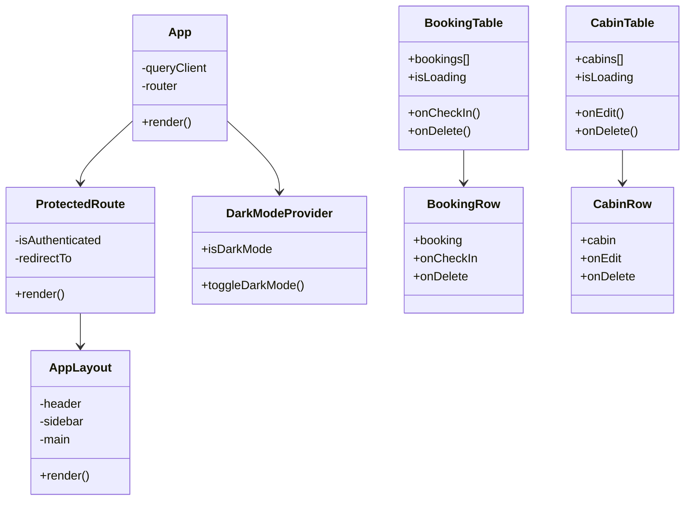

# The Wild Oasis - Components and Classes Documentation

## Overview

The Wild Oasis application is built using React functional components with a feature-based architecture. This document provides a detailed breakdown of the components, their relationships, and implementation patterns.

## Component Hierarchy



## Feature Modules

### 1. Authentication Module

#### LoginForm Component
```jsx
function LoginForm() {
  const [email, setEmail] = useState("");
  const [password, setPassword] = useState("");
  const { login, isLoading } = useLogin();

  async function handleSubmit(e) {
    e.preventDefault();
    await login({ email, password });
  }

  return (
    <Form onSubmit={handleSubmit}>
      <FormRow label="Email">
        <Input type="email" value={email} onChange={...} />
      </FormRow>
      <FormRow label="Password">
        <Input type="password" value={password} onChange={...} />
      </FormRow>
      <Button disabled={isLoading}>Log In</Button>
    </Form>
  );
}
```

**Plain English Explanation:**
- A form component for user authentication
- Takes email and password inputs
- Handles form submission and loading states
- Shows error messages if login fails

### 2. Booking Management

#### BookingTable Component
```jsx
function BookingTable() {
  const { bookings, isLoading } = useBookings();
  const [searchParams] = useSearchParams();

  // Filter bookings based on status
  const filterValue = searchParams.get("status") || "all";
  const filteredBookings = filterBookings(bookings, filterValue);

  // Sort bookings
  const sortBy = searchParams.get("sortBy") || "startDate-desc";
  const sortedBookings = sortBookings(filteredBookings, sortBy);

  return (
    <Table>
      <TableHeader>...</TableHeader>
      <TableBody>
        {sortedBookings.map(booking => (
          <BookingRow key={booking.id} booking={booking} />
        ))}
      </TableBody>
    </Table>
  );
}
```

**Plain English Explanation:**
- Displays a list of all bookings in a table format
- Supports filtering by booking status
- Allows sorting by different criteria
- Each booking is displayed in its own row

### 3. Cabin Management

#### AddCabin Component
```jsx
function AddCabin() {
  const { register, handleSubmit, reset, formState } = useForm();
  const { createCabin, isCreating } = useCreateCabin();

  function onSubmit(data) {
    const image = data.image[0];
    createCabin({ ...data, image }, {
      onSuccess: () => {
        reset();
        toast.success("Cabin created successfully");
      }
    });
  }

  return (
    <Form onSubmit={handleSubmit(onSubmit)}>
      <FormRow label="Cabin Name">
        <Input {...register("name", { required: true })} />
      </FormRow>
      {/* Other form fields */}
    </Form>
  );
}
```

**Plain English Explanation:**
- Form for adding new cabins to the system
- Handles file uploads for cabin images
- Validates form inputs
- Shows success/error messages
- Resets form after successful submission

## Custom Hooks

### 1. useBookings Hook
```typescript
interface Booking {
  id: number;
  startDate: Date;
  endDate: Date;
  status: string;
  // ... other fields
}

function useBookings() {
  const queryClient = useQueryClient();
  
  const {
    data: bookings,
    isLoading,
    error
  } = useQuery<Booking[]>({
    queryKey: ['bookings'],
    queryFn: getBookings
  });

  const { mutate: createBooking } = useMutation({
    mutationFn: createBookingApi,
    onSuccess: () => {
      queryClient.invalidateQueries(['bookings']);
      toast.success('Booking created!');
    }
  });

  return { bookings, isLoading, error, createBooking };
}
```

**Plain English Explanation:**
- Custom hook for managing booking data
- Fetches bookings from the server
- Provides functions to create new bookings
- Handles loading and error states
- Automatically updates the UI when data changes

### 2. useDarkMode Hook
```javascript
function useDarkMode() {
  const [isDarkMode, setIsDarkMode] = useLocalStorageState(
    'isDarkMode',
    window.matchMedia('(prefers-color-scheme: dark)').matches
  );

  useEffect(() => {
    document.documentElement.classList.toggle('dark-mode', isDarkMode);
  }, [isDarkMode]);

  return {
    isDarkMode,
    toggleDarkMode: () => setIsDarkMode(mode => !mode)
  };
}
```

**Plain English Explanation:**
- Manages the application's dark mode state
- Persists preference in localStorage
- Automatically detects system preference
- Updates document classes when mode changes

## UI Components

### 1. Modal Component
```jsx
const Modal = createContext();

function Modal({ children }) {
  const [isOpen, setIsOpen] = useState(false);

  return (
    <Modal.Provider value={{ isOpen, open, close }}>
      {children}
    </Modal.Provider>
  );
}

Modal.Open = function Open({ children }) {
  const { open } = useContext(Modal);
  return cloneElement(children, { onClick: () => open() });
};

Modal.Window = function Window({ children }) {
  const { isOpen, close } = useContext(Modal);
  return createPortal(
    <Overlay>
      <StyledModal>
        <Button onClick={close}>&times;</Button>
        {children}
      </StyledModal>
    </Overlay>,
    document.body
  );
};
```

**Plain English Explanation:**
- Reusable modal dialog component
- Uses React Context for state management
- Supports compound components pattern
- Renders using a portal for proper stacking

### 2. Table Component
```jsx
function Table({ columns, data, onRowClick }) {
  return (
    <TableWrapper>
      <TableHeader>
        {columns.map(column => (
          <th key={column.key}>{column.label}</th>
        ))}
      </TableHeader>
      <TableBody>
        {data.map(row => (
          <TableRow key={row.id} onClick={() => onRowClick?.(row)}>
            {columns.map(column => (
              <td key={column.key}>
                {column.render ? column.render(row) : row[column.key]}
              </td>
            ))}
          </TableRow>
        ))}
      </TableBody>
    </TableWrapper>
  );
}
```

**Plain English Explanation:**
- Generic table component
- Supports custom column rendering
- Handles row click events
- Flexible data display

## Form Components

### 1. Form Row
```jsx
function FormRow({ label, error, children }) {
  return (
    <StyledFormRow>
      <Label htmlFor={children.props.id}>{label}</Label>
      {children}
      {error && <Error>{error}</Error>}
    </StyledFormRow>
  );
}
```

### 2. Input
```jsx
const Input = styled.input`
  border: 1px solid var(--color-grey-300);
  background-color: var(--color-grey-0);
  border-radius: var(--border-radius-sm);
  padding: 0.8rem 1.2rem;
  box-shadow: var(--shadow-sm);
`;
```

## Best Practices

### 1. Component Organization
- Keep components focused and single-responsibility
- Use feature-based folder structure
- Separate business logic from UI components

### 2. State Management
- Use React Query for server state
- Use Context for global UI state
- Keep component state local when possible

### 3. Error Handling
- Implement error boundaries
- Show user-friendly error messages
- Log errors for debugging

### 4. Performance
- Memoize expensive computations
- Use pagination for large lists
- Implement proper loading states

## Testing Strategy

### 1. Unit Tests
```javascript
describe('BookingRow', () => {
  it('should display booking details', () => {
    const booking = {
      id: 1,
      startDate: '2023-09-15',
      guestName: 'John Doe'
    };
    render(<BookingRow booking={booking} />);
    expect(screen.getByText('John Doe')).toBeInTheDocument();
  });
});
```

### 2. Integration Tests
```javascript
describe('BookingFlow', () => {
  it('should create a new booking', async () => {
    render(<BookingForm />);
    // Fill form
    // Submit
    // Assert success
  });
});
```

---

This documentation is maintained alongside the component code. For specific implementation details, refer to the individual component files in the source code.
