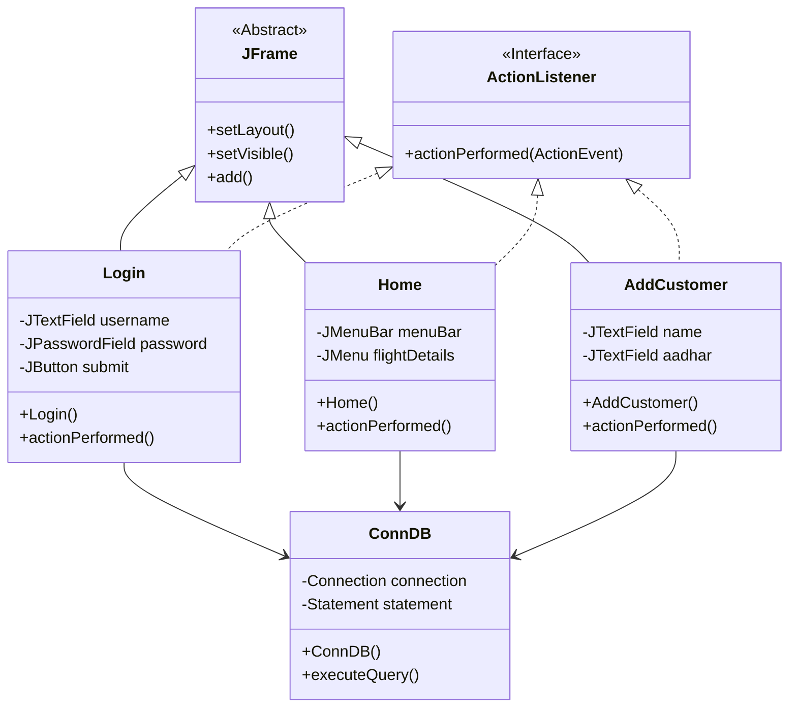

# Classes and Components

## Overview
The Airline Management System is built using object-oriented principles in Java, with each major functionality encapsulated in its own class. All GUI classes inherit from JFrame and implement ActionListener for event handling.

## Class Hierarchy

```
javax.swing.JFrame
    ├── Login
    ├── Home
    ├── AddCustomer
    ├── BookFlight
    ├── FlightInfo
    ├── JourneyDetails
    ├── Cancel
    └── BoardingPass

java.awt.event.ActionListener
    ├── Login
    ├── Home
    ├── AddCustomer
    ├── BookFlight
    ├── FlightInfo
    ├── JourneyDetails
    ├── Cancel
    └── BoardingPass

Database
    └── ConnDB
```

## Detailed Class Documentation

### 1. Login Class
Entry point for the application that handles user authentication.

```java
public class Login extends JFrame implements ActionListener {
    private JTextField username;
    private JPasswordField password;
    private JButton submit, close, reset;
    
    // Constructor
    public Login() {
        // Initialize GUI components
        setLayout(null);
        // Set up event listeners
        submit.addActionListener(this);
    }
    
    // Event handler
    public void actionPerformed(ActionEvent ae) {
        if (ae.getSource() == submit) {
            // Validate credentials
            // Navigate to Home on success
        }
    }
}
```

Key Components:
- **Username Field**: Text input for username
- **Password Field**: Secure password input
- **Submit Button**: Triggers authentication
- **Reset Button**: Clears input fields

Example Usage:
```java
Login loginWindow = new Login();
loginWindow.setVisible(true);
```

### 2. Home Class
Main dashboard providing access to all system features.

```java
public class Home extends JFrame implements ActionListener {
    private JMenuBar menuBar;
    private JMenu flightDetails, customerDetails;
    
    public Home() {
        // Set up menu bar
        menuBar = new JMenuBar();
        setJMenuBar(menuBar);
        
        // Add menu items
        flightDetails = new JMenu("Flight Details");
        menuBar.add(flightDetails);
    }
    
    public void actionPerformed(ActionEvent ae) {
        String action = ae.getActionCommand();
        switch(action) {
            case "Add Customer":
                new AddCustomer();
                break;
            case "Book Flight":
                new BookFlight();
                break;
            // ...
        }
    }
}
```

Features:
- Menu-based navigation
- Access to all system modules
- User interface management
- Event handling

### 3. AddCustomer Class
Handles customer registration and profile management.

```java
public class AddCustomer extends JFrame implements ActionListener {
    private JTextField name, nationality, phone, aadhar;
    private JTextArea address;
    private JRadioButton male, female;
    
    public AddCustomer() {
        // Initialize form components
        name = new JTextField();
        // Set up layout
        setLayout(null);
        // Add components
        add(name);
    }
    
    public void actionPerformed(ActionEvent ae) {
        // Validate input
        if (validateInput()) {
            // Save customer data
            saveCustomer();
        }
    }
    
    private void saveCustomer() {
        try {
            ConnDB conn = new ConnDB();
            // Execute SQL
        } catch (Exception e) {
            // Handle error
        }
    }
}
```

Key Features:
- Input validation
- Database integration
- Error handling
- User feedback

### 4. BookFlight Class
Manages the flight booking process.

```java
public class BookFlight extends JFrame implements ActionListener {
    private JTextField passengerDetails;
    private JComboBox<String> flights;
    private JDateChooser dateChooser;
    
    public BookFlight() {
        // Initialize booking form
        setLayout(null);
        // Set up components
        setupComponents();
    }
    
    public void actionPerformed(ActionEvent ae) {
        if (ae.getSource() == bookButton) {
            // Process booking
            createBooking();
        }
    }
    
    private void createBooking() {
        // Generate PNR
        String pnr = generatePNR();
        // Save booking
        saveBooking(pnr);
    }
}
```

Components:
- Passenger information
- Flight selection
- Date picker
- Booking confirmation

### 5. ConnDB Class
Manages database connections and operations.

```java
public class ConnDB {
    private Connection connection;
    private Statement statement;
    
    public ConnDB() {
        try {
            // Initialize connection
            Class.forName("com.mysql.cj.jdbc.Driver");
            connection = DriverManager.getConnection("jdbc:mysql:///airline");
            statement = connection.createStatement();
        } catch (Exception e) {
            e.printStackTrace();
        }
    }
    
    // Database operations
    public ResultSet executeQuery(String sql) {
        try {
            return statement.executeQuery(sql);
        } catch (SQLException e) {
            // Handle error
            return null;
        }
    }
}
```

Features:
- Connection management
- Query execution
- Resource cleanup
- Error handling

## Class Relationships

### 1. Inheritance
All GUI classes inherit from JFrame:
```java
public class Login extends JFrame { ... }
public class Home extends JFrame { ... }
// etc.
```

### 2. Interface Implementation
All GUI classes implement ActionListener:
```java
public class Login extends JFrame implements ActionListener { ... }
public class Home extends JFrame implements ActionListener { ... }
// etc.
```

### 3. Composition
GUI classes use ConnDB for database operations:
```java
public class BookFlight extends JFrame implements ActionListener {
    private ConnDB dbConnection;
    
    public void saveBooking() {
        dbConnection = new ConnDB();
        // Use connection
    }
}
```

## UML Class Diagram

```mermaid
classDiagram
    class JFrame {
        <<Abstract>>
        +setLayout()
        +setVisible()
        +add()
    }
    
    class ActionListener {
        <<Interface>>
        +actionPerformed(ActionEvent)
    }
    
    class Login {
        -JTextField username
        -JPasswordField password
        -JButton submit
        +Login()
        +actionPerformed()
    }
    
    class Home {
        -JMenuBar menuBar
        -JMenu flightDetails
        +Home()
        +actionPerformed()
    }
    
    class AddCustomer {
        -JTextField name
        -JTextField aadhar
        +AddCustomer()
        +actionPerformed()
    }
    
    class ConnDB {
        -Connection connection
        -Statement statement
        +ConnDB()
        +executeQuery()
    }
    
    JFrame <|-- Login
    JFrame <|-- Home
    JFrame <|-- AddCustomer
    ActionListener <|.. Login
    ActionListener <|.. Home
    ActionListener <|.. AddCustomer
    Login --> ConnDB
    Home --> ConnDB
    AddCustomer --> ConnDB
```

## Terms and Definitions

### GUI Components
- **JFrame**: Main window container
- **JTextField**: Text input field
- **JButton**: Clickable button
- **JMenuBar**: Menu container
- **JPanel**: Component container

### Event Handling
- **ActionListener**: Event handling interface
- **ActionEvent**: User action event
- **EventObject**: Base class for events

### Database
- **Connection**: Database connection
- **Statement**: SQL statement
- **ResultSet**: Query results
- **SQLException**: Database error

### Business Objects
- **PNR**: Booking reference
- **Aadhar**: ID number
- **Flight Code**: Flight identifier
