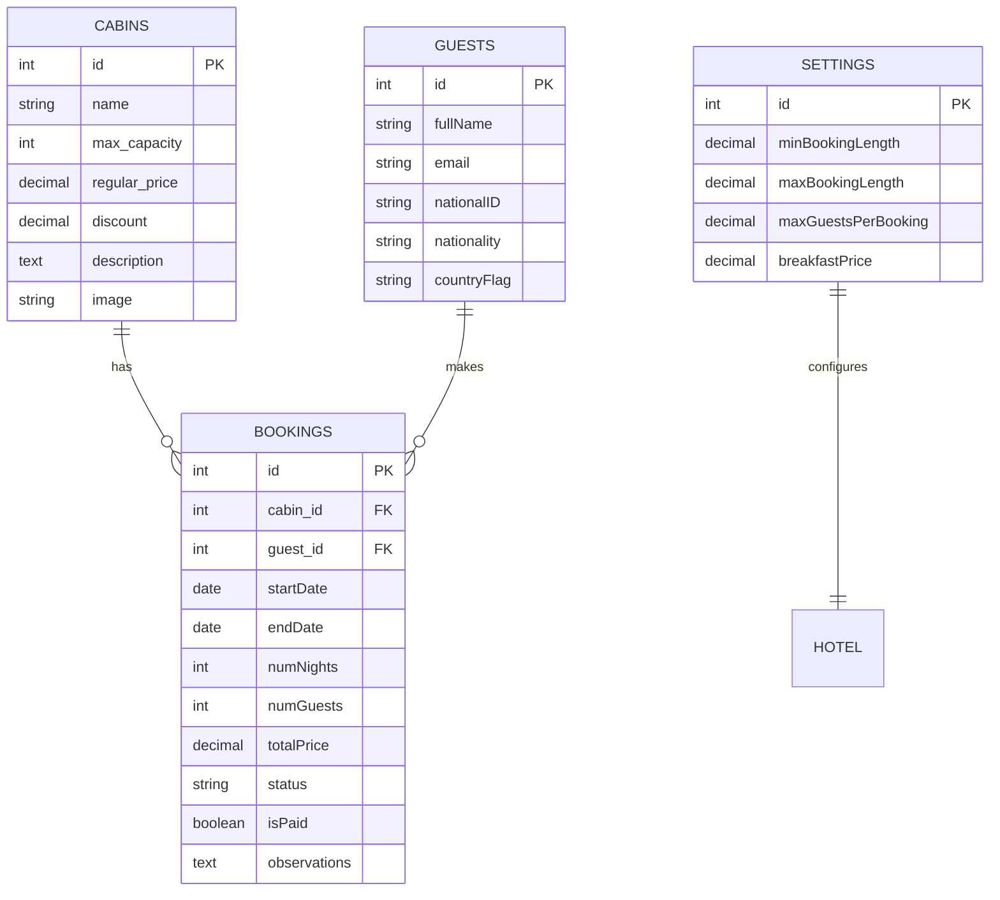

# Database Design

## Database Platform
The Wild Oasis uses **Supabase** as its database platform, which is built on top of PostgreSQL. Supabase provides:
- Robust PostgreSQL database
- Real-time subscriptions
- Row Level Security (RLS)
- Built-in authentication
- Automated API generation

## Entity-Relationship Diagram


## Table Descriptions

### 1. Cabins Table
Stores information about available cabins in the hotel.

#### Fields
| Field | Type | Description | Constraints |
|-------|------|-------------|-------------|
| id | int | Primary key | Auto-increment |
| name | string | Cabin name | Not null |
| maxCapacity | int | Maximum guests | > 0 |
| regularPrice | decimal | Standard rate | > 0 |
| discount | decimal | Discount amount | >= 0 |
| description | text | Cabin details | - |
| image | string | Image URL | - |

#### Example
```sql
CREATE TABLE cabins (
    id SERIAL PRIMARY KEY,
    name VARCHAR(100) NOT NULL,
    max_capacity INTEGER CHECK (max_capacity > 0),
    regular_price DECIMAL(10,2) CHECK (regular_price > 0),
    discount DECIMAL(10,2) DEFAULT 0,
    description TEXT,
    image VARCHAR(500)
);
```

### 2. Bookings Table
Manages all cabin bookings and their details.

#### Fields
| Field | Type | Description | Constraints |
|-------|------|-------------|-------------|
| id | int | Primary key | Auto-increment |
| cabin_id | int | Reference to cabin | Foreign key |
| guest_id | int | Reference to guest | Foreign key |
| startDate | date | Check-in date | Not null |
| endDate | date | Check-out date | Not null |
| numNights | int | Length of stay | Calculated |
| numGuests | int | Guest count | > 0 |
| totalPrice | decimal | Total cost | Calculated |
| status | string | Booking status | enum |
| isPaid | boolean | Payment status | Default false |
| observations | text | Special notes | - |

#### Example
```sql
CREATE TABLE bookings (
    id SERIAL PRIMARY KEY,
    cabin_id INTEGER REFERENCES cabins(id),
    guest_id INTEGER REFERENCES guests(id),
    start_date DATE NOT NULL,
    end_date DATE NOT NULL,
    num_nights INTEGER GENERATED ALWAYS AS 
        (DATE_PART('day', end_date - start_date)) STORED,
    num_guests INTEGER CHECK (num_guests > 0),
    total_price DECIMAL(10,2),
    status VARCHAR(20) CHECK (status IN 
        ('unconfirmed', 'confirmed', 'checked-in', 'checked-out')),
    is_paid BOOLEAN DEFAULT FALSE,
    observations TEXT
);
```

### 3. Guests Table
Contains information about hotel guests.

#### Fields
| Field | Type | Description | Constraints |
|-------|------|-------------|-------------|
| id | int | Primary key | Auto-increment |
| fullName | string | Guest name | Not null |
| email | string | Contact email | Unique |
| nationalID | string | ID number | Unique |
| nationality | string | Country | Not null |
| countryFlag | string | Flag emoji | - |

#### Example
```sql
CREATE TABLE guests (
    id SERIAL PRIMARY KEY,
    full_name VARCHAR(100) NOT NULL,
    email VARCHAR(254) UNIQUE,
    national_id VARCHAR(50) UNIQUE,
    nationality VARCHAR(50) NOT NULL,
    country_flag VARCHAR(2)
);
```

### 4. Settings Table
Stores hotel configuration and business rules.

#### Fields
| Field | Type | Description | Constraints |
|-------|------|-------------|-------------|
| id | int | Primary key | Single row |
| minBookingLength | decimal | Minimum nights | > 0 |
| maxBookingLength | decimal | Maximum nights | > 0 |
| maxGuestsPerBooking | decimal | Guest limit | > 0 |
| breakfastPrice | decimal | Breakfast rate | >= 0 |

#### Example
```sql
CREATE TABLE settings (
    id INTEGER PRIMARY KEY DEFAULT 1 CHECK (id = 1),
    min_booking_length INTEGER CHECK (min_booking_length > 0),
    max_booking_length INTEGER CHECK (max_booking_length > 0),
    max_guests_per_booking INTEGER CHECK (max_guests_per_booking > 0),
    breakfast_price DECIMAL(10,2) CHECK (breakfast_price >= 0)
);
```

## Database Relations

### One-to-Many Relations
1. **Cabin to Bookings**
   - One cabin can have multiple bookings
   - Each booking belongs to exactly one cabin

2. **Guest to Bookings**
   - One guest can have multiple bookings
   - Each booking belongs to exactly one guest

### One-to-One Relations
1. **Settings to Hotel**
   - Single settings record for the entire hotel
   - Enforced by primary key constraint

## Row Level Security (RLS)
Supabase RLS policies ensure data security:

```sql
-- Example RLS policy for bookings
CREATE POLICY "Authenticated users can view bookings"
ON bookings FOR SELECT
TO authenticated
USING (true);

CREATE POLICY "Staff can create bookings"
ON bookings FOR INSERT
TO authenticated
WITH CHECK (auth.role() = 'staff');
```

## Real-time Subscriptions
The application uses Supabase's real-time features for:
- Live booking updates
- Instant cabin availability
- Real-time dashboard statistics

Example subscription:
```javascript
supabase
  .from('bookings')
  .on('INSERT', payload => {
    // Handle new booking
  })
  .on('UPDATE', payload => {
    // Handle booking update
  })
  .subscribe()
```

## Database Migrations
Migrations are managed through Supabase migrations:
1. Schema changes
2. Data migrations
3. RLS policy updates

Example migration file:
```sql
-- Example migration
BEGIN;
  -- Add new column to cabins
  ALTER TABLE cabins ADD COLUMN last_cleaned TIMESTAMP;
  
  -- Add check constraint
  ALTER TABLE cabins 
    ADD CONSTRAINT positive_price 
    CHECK (regular_price > 0);
COMMIT;
```
