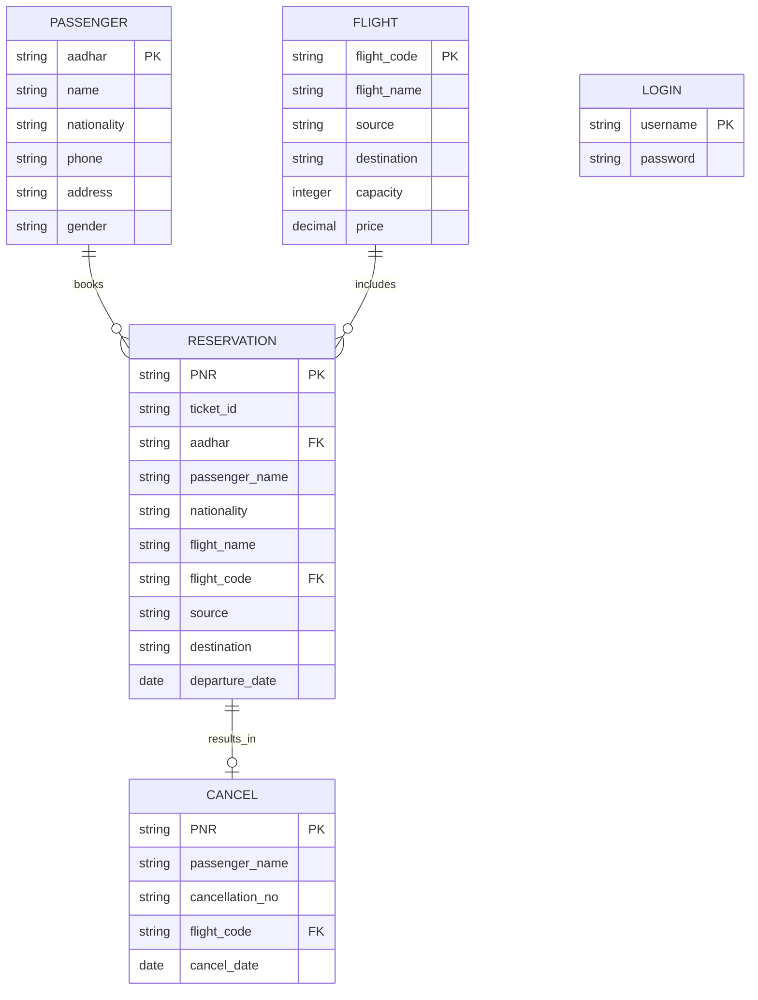

# Database Documentation

## Overview
The Airline Management System uses MySQL as its primary database management system. The database `airlinemanagementsystem` contains multiple tables to manage various aspects of airline operations.

## Database Connection
The system uses JDBC (Java Database Connectivity) for database operations. Connection configuration:
```java
URL: jdbc:mysql:///airlinemanagementsystem
Username: root
Password: root
Driver: com.mysql.cj.jdbc.Driver
```

## Entity Relationship Diagram

## Table Descriptions

### 1. PASSENGER Table
Stores customer information
- **Primary Key**: aadhar
- **Columns**:
  - `name`: Passenger's full name
  - `nationality`: Passenger's nationality
  - `phone`: Contact number
  - `aadhar`: Unique identification number
  - `address`: Residential address
  - `gender`: Passenger's gender

Example:
```sql
CREATE TABLE passenger (
    name VARCHAR(100),
    nationality VARCHAR(50),
    phone VARCHAR(15),
    aadhar VARCHAR(12) PRIMARY KEY,
    address TEXT,
    gender VARCHAR(10)
);
```

### 2. FLIGHT Table
Contains flight information
- **Primary Key**: flight_code
- **Columns**:
  - `flight_code`: Unique flight identifier
  - `flight_name`: Name of the flight
  - `source`: Departure city
  - `destination`: Arrival city
  - `capacity`: Passenger capacity
  - `price`: Ticket price

### 3. RESERVATION Table
Manages booking information
- **Primary Key**: PNR
- **Foreign Keys**:
  - `aadhar` references PASSENGER
  - `flight_code` references FLIGHT
- **Columns**:
  - `PNR`: Unique booking reference
  - `ticket_id`: Unique ticket identifier
  - `passenger_name`: Name of passenger
  - `nationality`: Passenger's nationality
  - `flight_name`: Name of booked flight
  - `source`: Departure city
  - `destination`: Arrival city
  - `departure_date`: Date of travel

Example:
```sql
INSERT INTO reservation VALUES(
    'PNR-123456',
    'TIC-1234',
    '123456789012',
    'John Doe',
    'American',
    'Flight 101',
    'FL101',
    'New York',
    'London',
    '2025-09-23'
);
```

### 4. CANCEL Table
Records cancelled bookings
- **Primary Key**: PNR
- **Foreign Key**: flight_code references FLIGHT
- **Columns**:
  - `PNR`: Booking reference being cancelled
  - `passenger_name`: Name of passenger
  - `cancellation_no`: Unique cancellation reference
  - `flight_code`: Associated flight code
  - `cancel_date`: Date of cancellation

### 5. LOGIN Table
Manages user authentication
- **Primary Key**: username
- **Columns**:
  - `username`: User login ID
  - `password`: User password (hashed)

## Data Operations

### 1. Booking Process
```sql
-- Check passenger exists
SELECT * FROM passenger WHERE aadhar = ?;

-- Check flight availability
SELECT * FROM flight WHERE source = ? AND destination = ?;

-- Create reservation
INSERT INTO reservation VALUES (?, ?, ?, ?, ?, ?, ?, ?, ?, ?);
```

### 2. Cancellation Process
```sql
-- Verify reservation
SELECT * FROM reservation WHERE PNR = ?;

-- Record cancellation
INSERT INTO cancel VALUES (?, ?, ?, ?, ?);

-- Remove reservation
DELETE FROM reservation WHERE PNR = ?;
```

## Database Maintenance

### Backup Procedures
1. Daily automated backups
2. Transaction log backups every hour
3. Full database backup weekly

### Performance Optimization
1. Indexed Fields:
   - PASSENGER.aadhar
   - RESERVATION.PNR
   - FLIGHT.flight_code

2. Query Optimization:
   - Prepared statements used for frequent queries
   - Connection pooling implemented
   - Proper indexing on search fields

### Data Security
1. Access Control:
   - Limited database user permissions
   - Encrypted password storage
   - Regular security audits

2. Data Integrity:
   - Foreign key constraints
   - Transaction management
   - Data validation before insertion

- `apiAuth.js`: User authentication operations
- `apiBookings.js`: Booking management
- `apiCabins.js`: Cabin operations
- `apiSettings.js`: Settings management

### Key Operations

1. **Bookings**

   - Create new bookings
   - Update booking status
   - Check availability
   - Calculate pricing

2. **Cabins**

   - Manage inventory
   - Update pricing
   - Handle images

3. **Users**
   - Authentication
   - Profile management
   - Role-based access
