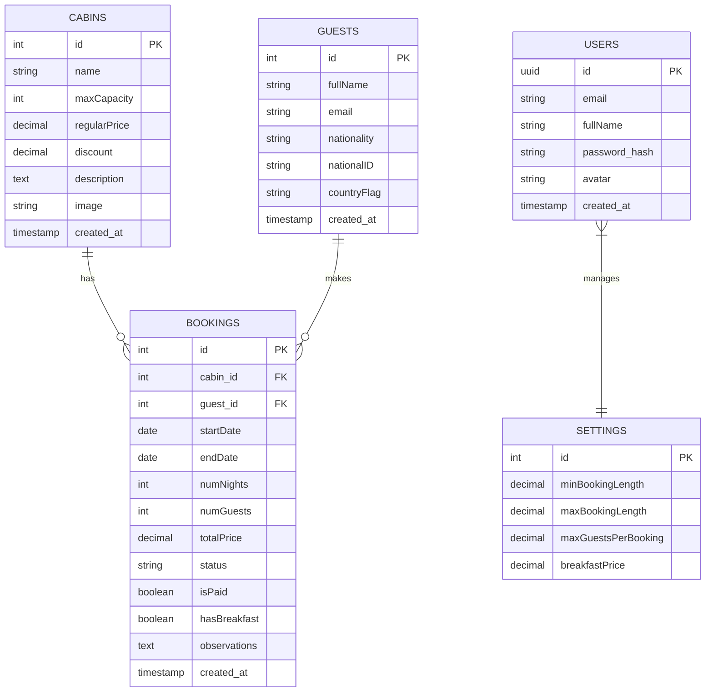

# The Wild Oasis - Database Documentation

## Database Overview

The Wild Oasis uses Supabase as its database service, which is built on PostgreSQL. This document outlines the database schema, relationships, and common operations.

## Supported Database

- **Primary Database**: PostgreSQL (via Supabase)
- **Version**: PostgreSQL 14+
- **Hosting**: Supabase Cloud Platform

## Entity-Relationship Diagram



## Table Descriptions

### 1. CABINS Table
Stores information about available rental cabins.

```sql
CREATE TABLE cabins (
    id SERIAL PRIMARY KEY,
    name VARCHAR(100) NOT NULL,
    maxCapacity INTEGER NOT NULL CHECK (maxCapacity > 0),
    regularPrice DECIMAL(10,2) NOT NULL CHECK (regularPrice > 0),
    discount DECIMAL(10,2) DEFAULT 0 CHECK (discount >= 0),
    description TEXT,
    image VARCHAR(255),
    created_at TIMESTAMP DEFAULT CURRENT_TIMESTAMP
);
```

Example cabin record:
```json
{
    "id": 1,
    "name": "001 - Cozy Cabin",
    "maxCapacity": 2,
    "regularPrice": 250.00,
    "discount": 25.00,
    "description": "A romantic cabin for two with mountain view",
    "image": "cabins/cabin-001.jpg"
}
```

### 2. BOOKINGS Table
Manages all cabin reservations and their details.

```sql
CREATE TABLE bookings (
    id SERIAL PRIMARY KEY,
    cabin_id INTEGER REFERENCES cabins(id),
    guest_id INTEGER REFERENCES guests(id),
    startDate DATE NOT NULL,
    endDate DATE NOT NULL,
    numNights INTEGER NOT NULL,
    numGuests INTEGER NOT NULL,
    totalPrice DECIMAL(10,2) NOT NULL,
    status VARCHAR(20) CHECK (status IN ('unconfirmed', 'confirmed', 'checked-in', 'checked-out')),
    isPaid BOOLEAN DEFAULT false,
    hasBreakfast BOOLEAN DEFAULT false,
    observations TEXT,
    created_at TIMESTAMP DEFAULT CURRENT_TIMESTAMP,
    CONSTRAINT valid_dates CHECK (endDate > startDate)
);
```

### 3. GUESTS Table
Stores information about guests who make bookings.

```sql
CREATE TABLE guests (
    id SERIAL PRIMARY KEY,
    fullName VARCHAR(100) NOT NULL,
    email VARCHAR(255) NOT NULL UNIQUE,
    nationality VARCHAR(50),
    nationalID VARCHAR(50),
    countryFlag VARCHAR(10),
    created_at TIMESTAMP DEFAULT CURRENT_TIMESTAMP
);
```

### 4. USERS Table
Manages system users (staff members) with authentication details.

```sql
CREATE TABLE users (
    id UUID PRIMARY KEY DEFAULT uuid_generate_v4(),
    email VARCHAR(255) NOT NULL UNIQUE,
    fullName VARCHAR(100) NOT NULL,
    password_hash VARCHAR(255) NOT NULL,
    avatar VARCHAR(255),
    created_at TIMESTAMP DEFAULT CURRENT_TIMESTAMP
);
```

### 5. SETTINGS Table
Stores application-wide configuration settings.

```sql
CREATE TABLE settings (
    id INTEGER PRIMARY KEY DEFAULT 1,
    minBookingLength DECIMAL(4,1) NOT NULL,
    maxBookingLength DECIMAL(4,1) NOT NULL,
    maxGuestsPerBooking INTEGER NOT NULL,
    breakfastPrice DECIMAL(10,2) NOT NULL,
    CONSTRAINT single_row CHECK (id = 1)
);
```

## Common Database Operations

### 1. Querying Bookings with Related Data
```javascript
const getBooking = async (id) => {
  const { data, error } = await supabase
    .from('bookings')
    .select(`
      *,
      cabins (*),
      guests (*)
    `)
    .eq('id', id)
    .single();

  if (error) throw new Error('Error fetching booking');
  return data;
};
```

### 2. Creating a New Cabin
```javascript
const createCabin = async (cabinData) => {
  const { data, error } = await supabase
    .from('cabins')
    .insert([cabinData])
    .select()
    .single();

  if (error) throw new Error('Error creating cabin');
  return data;
};
```

### 3. Updating Booking Status
```javascript
const updateBookingStatus = async (id, status) => {
  const { data, error } = await supabase
    .from('bookings')
    .update({ status })
    .eq('id', id)
    .single();

  if (error) throw new Error('Error updating booking');
  return data;
};
```

## Row Level Security (RLS) Policies

### 1. Cabins Table
```sql
-- Only authenticated users can view cabins
CREATE POLICY "Authenticated users can view cabins"
ON cabins FOR SELECT
USING (auth.role() = 'authenticated');

-- Only admin users can modify cabins
CREATE POLICY "Admin users can modify cabins"
ON cabins FOR ALL
USING (auth.user_id IN (SELECT id FROM users WHERE role = 'admin'));
```

### 2. Bookings Table
```sql
-- Users can only view their assigned bookings
CREATE POLICY "Users can view assigned bookings"
ON bookings FOR SELECT
USING (auth.role() = 'authenticated');
```

## Data Validation Rules

### 1. Booking Validation
```sql
-- Ensure booking dates are valid
ALTER TABLE bookings
ADD CONSTRAINT valid_booking_dates
CHECK (
    endDate > startDate
    AND numNights > 0
    AND numGuests > 0
);
```

### 2. Cabin Pricing Validation
```sql
-- Ensure valid pricing
ALTER TABLE cabins
ADD CONSTRAINT valid_pricing
CHECK (
    regularPrice > 0
    AND discount >= 0
    AND discount <= regularPrice
);
```

## Indexing Strategy

```sql
-- Booking queries optimization
CREATE INDEX idx_bookings_dates ON bookings(startDate, endDate);
CREATE INDEX idx_bookings_status ON bookings(status);

-- Cabin search optimization
CREATE INDEX idx_cabins_price ON cabins(regularPrice);
CREATE INDEX idx_cabins_capacity ON cabins(maxCapacity);
```

## Backup and Recovery

### 1. Automated Backups
- Daily full database backups
- Point-in-time recovery available
- 30-day backup retention

### 2. Manual Backup
```sql
-- Create a backup
pg_dump -U postgres -d wild_oasis > backup.sql

-- Restore from backup
psql -U postgres -d wild_oasis < backup.sql
```

## Performance Optimization

### 1. Query Optimization
- Use appropriate indexes
- Implement efficient JOIN operations
- Use pagination for large datasets

### 2. Connection Pooling
- Managed by Supabase
- Optimal connection management
- Automatic scaling

## Monitoring and Maintenance

### 1. Performance Monitoring
- Query execution time tracking
- Resource utilization monitoring
- Error rate tracking

### 2. Regular Maintenance Tasks
```sql
-- Regular cleanup of old sessions
DELETE FROM sessions WHERE created_at < NOW() - INTERVAL '30 days';

-- Update statistics
ANALYZE bookings;
ANALYZE cabins;
```

---

This database documentation is maintained alongside the application code. For specific implementation details, refer to the API service files in the `services` directory.
