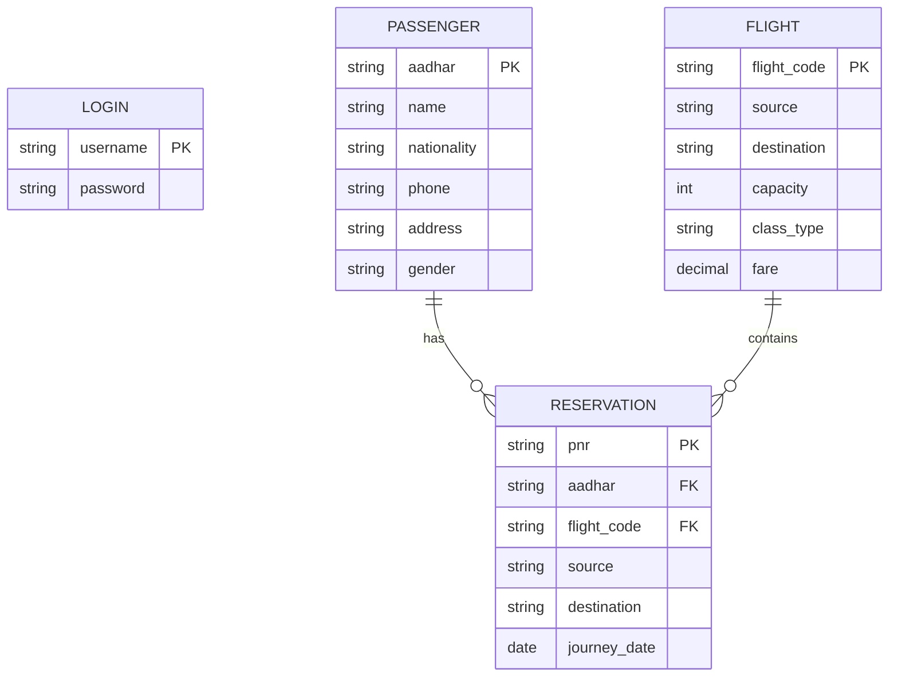

# Database Design

## Supported Databases
The Airline Management System primarily supports MySQL (version 5.7 and above) as its database management system. The system uses JDBC for database connectivity and DbUtils for result set handling.

### Database Connection
```java
// Connection configuration
String url = "jdbc:mysql:///airline";
String driver = "com.mysql.cj.jdbc.Driver";

// Connection implementation
public class ConnDB {
    Connection c;
    Statement s;
    
    public ConnDB() {
        try {
            Class.forName(driver);
            c = DriverManager.getConnection(url);
            s = c.createStatement();
        } catch(Exception e) {
            e.printStackTrace();
        }
    }
}
```

## Entity-Relationship Diagram

```mermaid
erDiagram
    LOGIN {
        string username PK
        string password
    }

    PASSENGER {
        string aadhar PK
        string name
        string nationality
        string phone
        string address
        string gender
    }

    RESERVATION {
        string pnr PK
        string aadhar FK
        string flight_code FK
        string source
        string destination
        date journey_date
    }

    FLIGHT {
        string flight_code PK
        string source
        string destination
        int capacity
        string class_type
        decimal fare
    }

    PASSENGER ||--o{ RESERVATION : has
    FLIGHT ||--o{ RESERVATION : contains
```

## Database Schema

### 1. login Table
Stores user authentication credentials.

```sql
CREATE TABLE login (
    username VARCHAR(50) PRIMARY KEY,
    password VARCHAR(50) NOT NULL
);
```

Example Usage:
```java
// Authentication query
String query = "SELECT * FROM login WHERE username='" + username + 
               "' AND password='" + password + "'";
ResultSet rs = stmt.executeQuery(query);
```

Fields:
- **username**: Unique identifier for each user
- **password**: User's authentication credential

### 2. passenger Table
Stores customer information.

```sql
CREATE TABLE passenger (
    aadhar VARCHAR(12) PRIMARY KEY,
    name VARCHAR(100) NOT NULL,
    nationality VARCHAR(50),
    phone VARCHAR(20),
    address TEXT,
    gender VARCHAR(10)
);
```

Example Usage:
```java
// Adding new passenger
String query = "INSERT INTO passenger VALUES ('" + aadhar + "', '" +
               name + "', '" + nationality + "', '" + phone + "', '" +
               address + "', '" + gender + "')";
stmt.executeUpdate(query);
```

Fields:
- **aadhar**: Unique identification number (Primary Key)
- **name**: Full name of the passenger
- **nationality**: Passenger's nationality
- **phone**: Contact number
- **address**: Residential address
- **gender**: Gender identification

### 3. reservation Table
Manages flight bookings.

```sql
CREATE TABLE reservation (
    pnr VARCHAR(10) PRIMARY KEY,
    aadhar VARCHAR(12),
    flight_code VARCHAR(10),
    source VARCHAR(50),
    destination VARCHAR(50),
    date DATE,
    FOREIGN KEY (aadhar) REFERENCES passenger(aadhar)
);
```

Example Usage:
```java
// Creating new reservation
String query = "INSERT INTO reservation VALUES ('" + pnr + "', '" +
               aadhar + "', '" + flightCode + "', '" + source + "', '" +
               destination + "', '" + date + "')";
stmt.executeUpdate(query);
```

Fields:
- **pnr**: Passenger Name Record (Primary Key)
- **aadhar**: Customer identifier (Foreign Key)
- **flight_code**: Flight identifier
- **source**: Departure location
- **destination**: Arrival location
- **date**: Journey date

### 4. flight Table
Contains flight information.

```sql
CREATE TABLE flight (
    flight_code VARCHAR(10) PRIMARY KEY,
    source VARCHAR(50),
    destination VARCHAR(50),
    capacity INT,
    class_type VARCHAR(20),
    fare DECIMAL(10,2)
);
```

Example Usage:
```java
// Retrieving flight details
String query = "SELECT * FROM flight WHERE source='" + source + 
               "' AND destination='" + destination + "'";
ResultSet rs = stmt.executeQuery(query);
```

Fields:
- **flight_code**: Unique flight identifier
- **source**: Departure airport
- **destination**: Arrival airport
- **capacity**: Passenger capacity
- **class_type**: Class of service
- **fare**: Ticket price

## Common Database Operations

### 1. Customer Registration
```java
// Add new customer
public void addCustomer(String name, String aadhar, String nationality) {
    try {
        String query = "INSERT INTO passenger VALUES (...)";
        stmt.executeUpdate(query);
    } catch (SQLException e) {
        // Handle error
    }
}
```

### 2. Flight Booking
```java
// Create new booking
public String bookFlight(String aadhar, String flightCode) {
    String pnr = generatePNR();
    try {
        String query = "INSERT INTO reservation VALUES (...)";
        stmt.executeUpdate(query);
        return pnr;
    } catch (SQLException e) {
        // Handle error
        return null;
    }
}
```

### 3. Ticket Cancellation
```java
// Cancel booking
public boolean cancelBooking(String pnr) {
    try {
        String query = "DELETE FROM reservation WHERE pnr='" + pnr + "'";
        int result = stmt.executeUpdate(query);
        return result > 0;
    } catch (SQLException e) {
        // Handle error
        return false;
    }
}
```

## Data Management

### 1. Data Integrity
- Primary Key constraints
- Foreign Key relationships
- NOT NULL constraints
- Data type validation

### 2. Error Handling
```java
try {
    // Database operation
} catch (SQLException e) {
    JOptionPane.showMessageDialog(null, "Database Error: " + 
                                e.getMessage());
    logger.error("Database error", e);
}
```

### 3. Transaction Management
```java
Connection conn = null;
try {
    conn = getConnection();
    conn.setAutoCommit(false);
    // Perform multiple operations
    conn.commit();
} catch (SQLException e) {
    if (conn != null) {
        conn.rollback();
    }
    // Handle error
}
```

## Terms and Definitions

### Database Terms
- **Primary Key (PK)**: Unique identifier for a record
- **Foreign Key (FK)**: Reference to another table's primary key
- **JDBC**: Java Database Connectivity API
- **ResultSet**: Container for query results
- **PreparedStatement**: Precompiled SQL statement

### Business Terms
- **PNR**: Passenger Name Record
- **Aadhar**: Unique identification number
- **Source**: Departure location
- **Destination**: Arrival location
