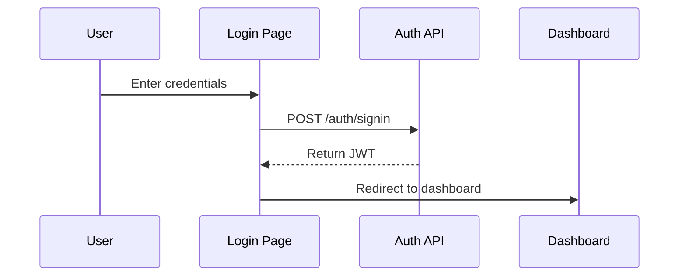
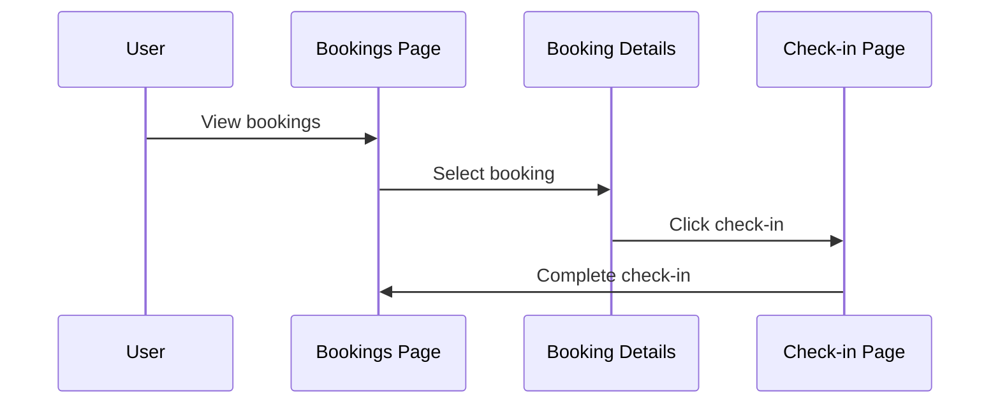

# The Wild Oasis - Web Documentation

## Overview

This document outlines the web architecture of The Wild Oasis application, including API endpoints, routing structure, and navigation flows. The application uses React Router for client-side routing and Supabase for API endpoints.

## API Endpoints

### Authentication API

#### 1. User Authentication
```typescript
interface AuthCredentials {
  email: string;
  password: string;
}

interface UserResponse {
  user: User;
  session: Session;
}

// Login
POST /auth/v1/signin
Body: AuthCredentials
Response: UserResponse

// Signup
POST /auth/v1/signup
Body: AuthCredentials & { fullName: string }
Response: UserResponse

// Logout
POST /auth/v1/signout
Response: { success: true }
```

Example usage:
```javascript
const loginApi = async ({ email, password }) => {
  const { data, error } = await supabase.auth.signInWithPassword({
    email,
    password
  });
  if (error) throw new Error(error.message);
  return data;
};
```

### Bookings API

#### 1. Booking Management
```typescript
interface Booking {
  id: number;
  cabinId: number;
  guestId: number;
  startDate: string;
  endDate: string;
  numNights: number;
  numGuests: number;
  status: 'unconfirmed' | 'confirmed' | 'checked-in' | 'checked-out';
  totalPrice: number;
  observations?: string;
}

// Get all bookings
GET /rest/v1/bookings
Query params: 
  - status: string
  - sortBy: string
  - page: number

// Get single booking
GET /rest/v1/bookings?id=eq.{id}&select=*,cabins(*),guests(*)

// Create booking
POST /rest/v1/bookings
Body: Omit<Booking, 'id'>

// Update booking
PATCH /rest/v1/bookings?id=eq.{id}
Body: Partial<Booking>
```

Example usage:
```javascript
const getBookings = async ({ filter, sortBy, page }) => {
  let query = supabase
    .from('bookings')
    .select('*, cabins(*), guests(*)');

  if (filter) query = query.eq(filter.field, filter.value);
  if (sortBy) query = query.order(sortBy.field, { ascending: sortBy.direction === 'asc' });
  
  const { data, error } = await query;
  if (error) throw new Error('Could not load bookings');
  return data;
};
```

### Cabins API

#### 1. Cabin Management
```typescript
interface Cabin {
  id: number;
  name: string;
  maxCapacity: number;
  regularPrice: number;
  discount: number;
  description: string;
  image: string;
}

// Get all cabins
GET /rest/v1/cabins

// Create cabin
POST /rest/v1/cabins
Body: Omit<Cabin, 'id'>

// Update cabin
PATCH /rest/v1/cabins?id=eq.{id}
Body: Partial<Cabin>

// Delete cabin
DELETE /rest/v1/cabins?id=eq.{id}
```

## Application Routes

### Route Structure
```jsx
<BrowserRouter>
  <Routes>
    <Route element={<ProtectedRoute><AppLayout /></ProtectedRoute>}>
      <Route index element={<Navigate to="dashboard" />} />
      <Route path="dashboard" element={<Dashboard />} />
      <Route path="bookings" element={<Bookings />} />
      <Route path="bookings/:bookingId" element={<Booking />} />
      <Route path="checkin/:bookingId" element={<Checkin />} />
      <Route path="cabins" element={<Cabins />} />
      <Route path="users" element={<Users />} />
      <Route path="settings" element={<Settings />} />
      <Route path="account" element={<Account />} />
    </Route>
    <Route path="login" element={<Login />} />
    <Route path="*" element={<PageNotFound />} />
  </Routes>
</BrowserRouter>
```

### Page Components

#### 1. Dashboard (`/dashboard`)
The main landing page showing business statistics and recent activity.

```jsx
function Dashboard() {
  const { bookings, isLoading: isLoadingBookings } = useRecentBookings();
  const { stats, isLoading: isLoadingStats } = useStats();

  if (isLoadingBookings || isLoadingStats) return <Spinner />;

  return (
    <StyledDashboard>
      <Stats stats={stats} />
      <TodayActivity />
      <DurationChart />
      <SalesChart bookings={bookings} />
    </StyledDashboard>
  );
}
```

#### 2. Bookings Page (`/bookings`)
Lists all bookings with filtering and sorting capabilities.

```jsx
function Bookings() {
  const [searchParams] = useSearchParams();
  const { bookings, isLoading } = useBookings();

  // Filter and sort operations
  const filteredBookings = filterBookings(bookings, searchParams);
  const sortedBookings = sortBookings(filteredBookings, searchParams);

  return (
    <BookingsLayout>
      <BookingTableOperations />
      <BookingTable bookings={sortedBookings} />
      <Pagination />
    </BookingsLayout>
  );
}
```

## Navigation Flows

### 1. Authentication Flow



### 2. Booking Management Flow



## State Management

### 1. URL State
Used for filtering and sorting in list views:
```javascript
// Current URL: /bookings?status=checked-in&sortBy=date
const [searchParams] = useSearchParams();
const status = searchParams.get("status"); // "checked-in"
const sortBy = searchParams.get("sortBy"); // "date"
```

### 2. Form State
Using React Hook Form for form management:
```javascript
function CreateBookingForm() {
  const { register, handleSubmit, formState: { errors } } = useForm();
  
  return (
    <Form onSubmit={handleSubmit(onSubmit)}>
      <Input {...register("guestName", { required: true })} />
      {errors.guestName && <Error>This field is required</Error>}
    </Form>
  );
}
```

## Error Handling

### 1. API Error Handling
```javascript
try {
  const response = await apiCall();
  // Handle success
} catch (error) {
  toast.error(error.message);
  // Log error for monitoring
  console.error("[API Error]:", error);
}
```

### 2. Route Protection
```javascript
function ProtectedRoute({ children }) {
  const { isAuthenticated, isLoading } = useUser();
  
  if (isLoading) return <Spinner />;
  if (!isAuthenticated) return <Navigate to="/login" />;
  
  return children;
}
```

## Performance Optimization

### 1. Query Caching
```javascript
const { data: bookings } = useQuery({
  queryKey: ['bookings'],
  queryFn: getBookings,
  staleTime: 1000 * 60 * 5, // 5 minutes
  cacheTime: 1000 * 60 * 15 // 15 minutes
});
```

### 2. Route-based Code Splitting
```javascript
const Dashboard = lazy(() => import('./pages/Dashboard'));
const Bookings = lazy(() => import('./pages/Bookings'));
const Settings = lazy(() => import('./pages/Settings'));
```

## Development Guidelines

### 1. Adding New Routes
1. Create page component in `pages` directory
2. Add route definition in `App.jsx`
3. Update navigation menu
4. Implement necessary API endpoints

### 2. API Integration
1. Create API function in appropriate service file
2. Create custom hook for data management
3. Implement error handling
4. Add loading states and optimistic updates

### 3. Form Implementation
1. Use React Hook Form for form state
2. Implement proper validation
3. Show loading states during submission
4. Handle success and error cases

## Monitoring and Analytics

### 1. Error Tracking
```javascript
window.addEventListener('error', (event) => {
  // Log error to monitoring service
  logError({
    message: event.message,
    stack: event.error?.stack,
    location: window.location.href
  });
});
```

### 2. Performance Monitoring
- Route change timing
- API response times
- Component render performance

---

This documentation is maintained alongside the application code. For specific implementation details, refer to the source files in the respective directories.
