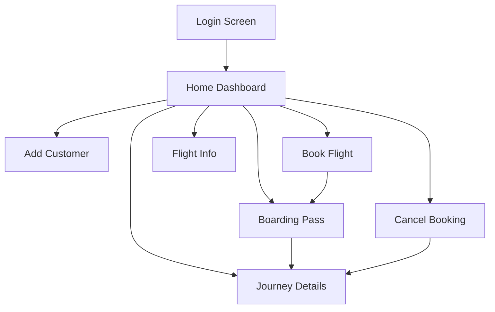
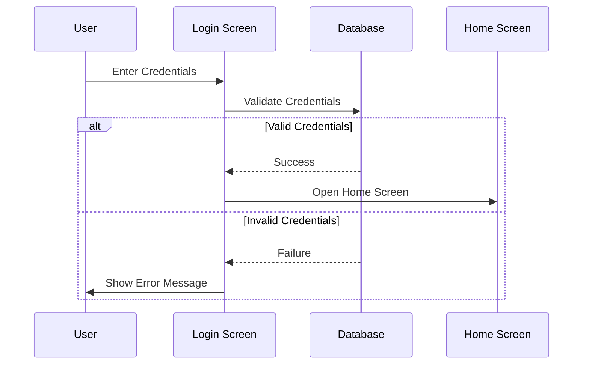
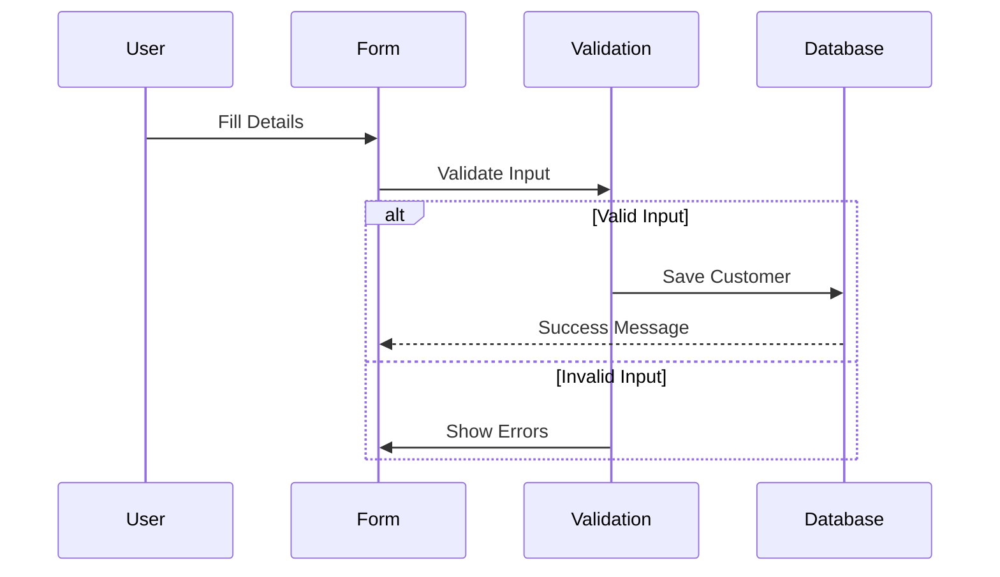
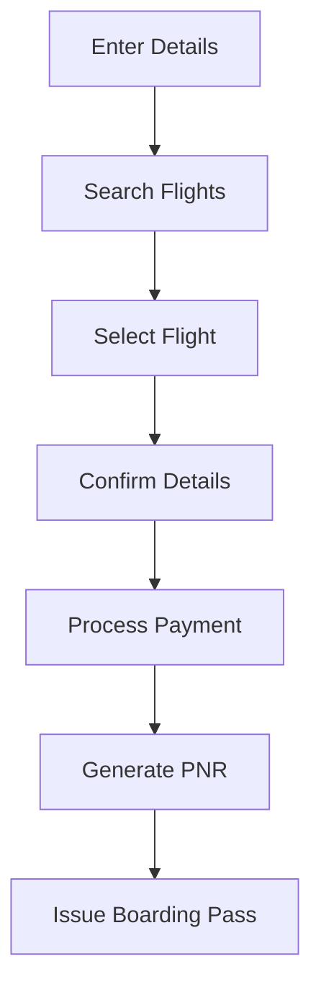

# User Interface Flow Documentation

## Overview
The Airline Management System provides a desktop-based graphical user interface built using Java Swing. This document outlines the navigation flow, screen interactions, and user interface components.

## Screen Navigation Map

## Screen Descriptions

### 1. Login Screen (`Login.java`)
Entry point for user authentication.

**Components**:
- Username text field
- Password field
- Login button
- Clear button

**Flow**:


### 2. Home Dashboard (`Home.java`)
Central navigation hub for all system features.

**Menu Options**:
- Customer Management
- Flight Booking
- Flight Information
- Journey Details
- Cancellation

**Layout**:
```
+------------------------+
|      Airline Logo      |
+------------------------+
|   Quick Access Menu    |
+------------------------+
|                        |
|    Feature Buttons     |
|                        |
+------------------------+
|      Status Bar        |
+------------------------+
```

### 3. Add Customer (`AddCustomer.java`)
Customer registration interface.

**Form Fields**:
- Name
- Nationality
- Address
- Phone
- Aadhar (ID)
- Gender

**Workflow**:


### 4. Book Flight (`BookFlight.java`)
Flight reservation interface.

**Steps**:
1. Enter passenger details
2. Select flight
3. Confirm booking
4. Generate PNR

**Process Flow**:


### 5. Boarding Pass (`BoardingPass.java`)
Travel document generation screen.

**Features**:
- PNR lookup
- Passenger details display
- Flight information
- Seat assignment
- Print functionality

### 6. Flight Information (`FlightInfo.java`)
Flight schedule and details display.

**Table Columns**:
- Flight Code
- Source
- Destination
- Departure
- Arrival
- Price
- Available Seats

### 7. Journey Details (`JourneyDetails.java`)
Travel itinerary information screen.

**Information Display**:
- Booking reference (PNR)
- Passenger details
- Flight details
- Travel dates
- Status

### 8. Cancel Booking (`Cancel.java`)
Reservation cancellation interface.

**Process**:
1. Enter PNR
2. Verify booking
3. Confirm cancellation
4. Generate refund details

## Common UI Elements

### 1. Form Components
Standard input elements used across screens:
```java
// Text Fields
JTextField textField = new JTextField(20);
textField.setBounds(x, y, width, height);

// Buttons
JButton button = new JButton("Action");
button.addActionListener(this);

// Labels
JLabel label = new JLabel("Field Name:");
```

### 2. Dialog Boxes
Consistent message display:
```java
// Success Message
JOptionPane.showMessageDialog(null, 
    "Operation Successful",
    "Success",
    JOptionPane.INFORMATION_MESSAGE);

// Error Message
JOptionPane.showMessageDialog(null,
    "Error Details",
    "Error",
    JOptionPane.ERROR_MESSAGE);
```

### 3. Tables
Data display format:
```java
JTable table = new JTable(data, columnNames);
JScrollPane scrollPane = new JScrollPane(table);
```

## Navigation Patterns

### 1. Screen Transitions
```java
// Opening new screen
NewScreen newScreen = new NewScreen();
newScreen.setVisible(true);

// Closing current screen
this.setVisible(false);
```

### 2. Menu Navigation
```java
// Menu item action
menuItem.addActionListener(e -> {
    new FeatureScreen().setVisible(true);
});
```

## Error Handling

### 1. Input Validation
```java
private boolean validateInput() {
    if (textField.getText().isEmpty()) {
        showError("Field cannot be empty");
        return false;
    }
    return true;
}
```

### 2. Database Errors
```java
try {
    // Database operation
} catch (SQLException e) {
    showError("Database Error: " + e.getMessage());
}
```

## Best Practices

### 1. Screen Layout
- Consistent component placement
- Proper spacing and alignment
- Clear visual hierarchy

### 2. User Feedback
- Immediate response to actions
- Clear error messages
- Operation success confirmation

### 3. Navigation
- Intuitive menu structure
- Easy access to common functions
- Clear return paths

## Usability Guidelines

### 1. Form Design
- Logical field order
- Required field indication
- Clear validation messages

### 2. Error Prevention
- Input format hints
- Confirmation dialogs
- Clear action buttons

### 3. Performance
- Quick screen loading
- Responsive interface
- Efficient data retrieval

## Testing Procedures

### 1. Interface Testing
- Component functionality
- Navigation flow
- Error handling

### 2. Usability Testing
- Task completion
- Error recovery
- User satisfaction

## Maintenance

### 1. UI Updates
- Component consistency
- Style guide adherence
- Regular review

### 2. Performance Monitoring
- Screen load times
- Response times
- Resource usage

- Protected routes
- Role-based access
- Secure token handling

### Data Protection

- Input sanitization
- HTTPS encryption
- Secure API calls
