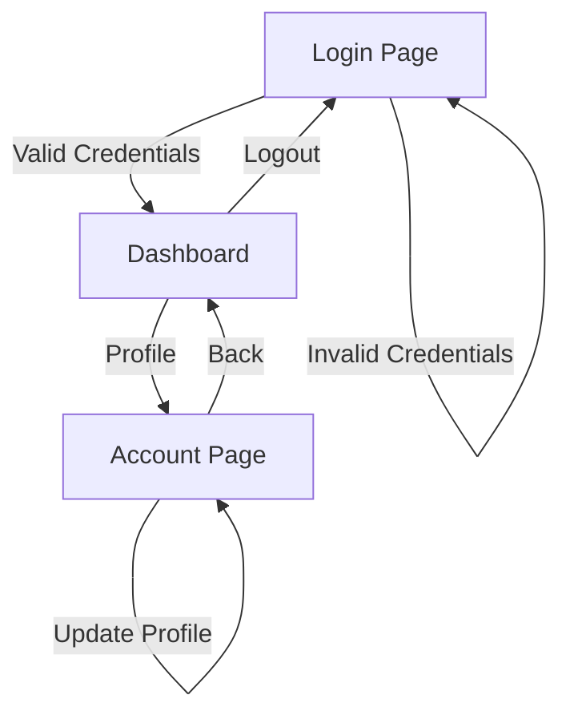
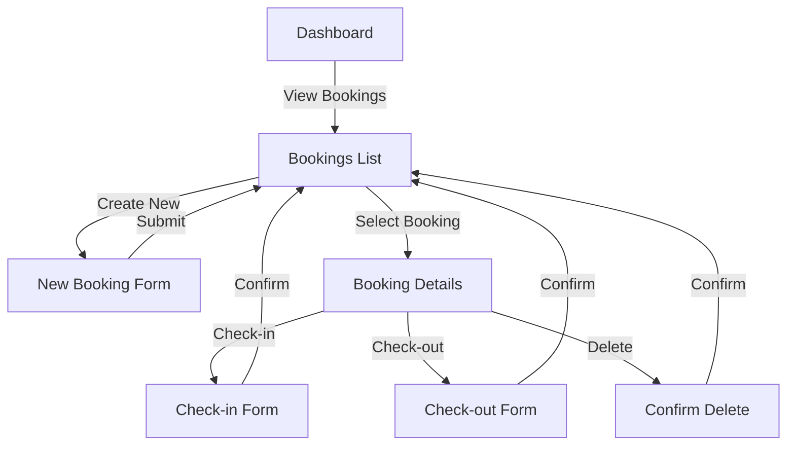
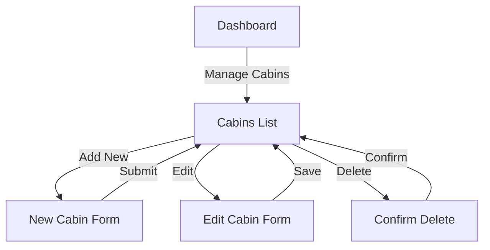

# Web Interface Documentation

## Pages Structure

### 1. Authentication Pages

#### Login Page (`/login`)
- **Component**: `Login.jsx`
- **Purpose**: User authentication
- **Features**:
  - Email/password login
  - Error handling
  - Remember me functionality
  - Protected route redirect

#### User Account (`/account`)
- **Component**: `Account.jsx`
- **Purpose**: User profile management
- **Features**:
  - Update profile information
  - Change password
  - Upload avatar

### 2. Main Application Pages

#### Dashboard (`/dashboard`)
- **Component**: `Dashboard.jsx`
- **Purpose**: Overview of hotel operations
- **Features**:
  - Today's activities
  - Statistics overview
  - Recent bookings
  - Charts and graphs
  - Occupancy rate

#### Bookings (`/bookings`)
- **Component**: `Bookings.jsx`
- **Purpose**: Booking management
- **Features**:
  - Booking list with filters
  - Search functionality
  - Sorting options
  - Status updates
  - Pagination

#### Cabins (`/cabins`)
- **Component**: `Cabins.jsx`
- **Purpose**: Cabin management
- **Features**:
  - Cabin list
  - Add/Edit/Delete cabins
  - Image management
  - Pricing controls
  - Discount settings

#### Settings (`/settings`)
- **Component**: `Settings.jsx`
- **Purpose**: Application configuration
- **Features**:
  - Hotel settings
  - Booking rules
  - Pricing settings
  - System preferences

## API Endpoints

### Authentication API
Location: `services/apiAuth.js`

#### Login
```javascript
POST /auth/signin
Body: {
  email: string,
  password: string
}
Response: {
  user: UserObject,
  token: string
}
```

#### Update User
```javascript
PATCH /auth/users
Body: {
  fullName?: string,
  avatar?: File,
  password?: string
}
Response: {
  user: UserObject
}
```

### Bookings API
Location: `services/apiBookings.js`

#### Get Bookings
```javascript
GET /bookings
Query Parameters:
  - filter: string
  - sortBy: string
  - page: number
Response: {
  data: BookingObject[],
  count: number
}
```

#### Create Booking
```javascript
POST /bookings
Body: {
  cabinId: number,
  guestId: number,
  startDate: Date,
  endDate: Date,
  numGuests: number,
  observations?: string
}
Response: {
  booking: BookingObject
}
```

#### Update Booking Status
```javascript
PATCH /bookings/{id}
Body: {
  status: 'unconfirmed' | 'confirmed' | 'checked-in' | 'checked-out'
}
Response: {
  booking: BookingObject
}
```

### Cabins API
Location: `services/apiCabins.js`

#### Get Cabins
```javascript
GET /cabins
Response: {
  data: CabinObject[]
}
```

#### Create Cabin
```javascript
POST /cabins
Body: {
  name: string,
  maxCapacity: number,
  regularPrice: number,
  discount?: number,
  description?: string,
  image?: File
}
Response: {
  cabin: CabinObject
}
```

#### Update Cabin
```javascript
PATCH /cabins/{id}
Body: {
  name?: string,
  maxCapacity?: number,
  regularPrice?: number,
  discount?: number,
  description?: string,
  image?: File
}
Response: {
  cabin: CabinObject
}
```

### Settings API
Location: `services/apiSettings.js`

#### Get Settings
```javascript
GET /settings
Response: {
  settings: SettingsObject
}
```

#### Update Settings
```javascript
PATCH /settings
Body: {
  minBookingLength?: number,
  maxBookingLength?: number,
  maxGuestsPerBooking?: number,
  breakfastPrice?: number
}
Response: {
  settings: SettingsObject
}
```

## Navigation Flow

### 1. Authentication Flow


### 2. Booking Management Flow


### 3. Cabin Management Flow


## Protected Routes
Location: `pages/ProtectedRoute.jsx`

### Route Protection Logic
```javascript
// Example of protected route implementation
const ProtectedRoute = ({ children }) => {
  const { isAuthenticated, isLoading } = useUser();
  
  if (isLoading) return <Spinner />;
  
  if (!isAuthenticated) {
    return <Navigate to="/login" replace />;
  }
  
  return children;
};
```

### Protected Routes Configuration
```javascript
// Example of route configuration
<BrowserRouter>
  <Routes>
    <Route path="/login" element={<Login />} />
    <Route
      element={
        <ProtectedRoute>
          <AppLayout />
        </ProtectedRoute>
      }
    >
      <Route path="/dashboard" element={<Dashboard />} />
      <Route path="/bookings" element={<Bookings />} />
      <Route path="/cabins" element={<Cabins />} />
      <Route path="/settings" element={<Settings />} />
      <Route path="/account" element={<Account />} />
    </Route>
  </Routes>
</BrowserRouter>
```

## Error Handling

### 1. API Error Handling
```javascript
// Example of API error handling
const handleApiError = (error) => {
  if (error.status === 401) {
    toast.error('Please log in again');
    navigate('/login');
  } else if (error.status === 403) {
    toast.error('You do not have permission to perform this action');
  } else {
    toast.error('Something went wrong! Please try again.');
  }
};
```

### 2. Form Validation
```javascript
// Example of form validation
const validationSchema = {
  email: {
    required: 'Email is required',
    pattern: {
      value: /^[A-Z0-9._%+-]+@[A-Z0-9.-]+\.[A-Z]{2,}$/i,
      message: 'Invalid email address'
    }
  },
  password: {
    required: 'Password is required',
    minLength: {
      value: 8,
      message: 'Password must be at least 8 characters'
    }
  }
};
```

## Response Handling

### 1. Success Responses
```javascript
// Example of success response handling
const handleSuccess = (response) => {
  toast.success(response.message);
  queryClient.invalidateQueries('bookings');
  navigate('/bookings');
};
```

### 2. Loading States
```javascript
// Example of loading state handling
{isLoading ? (
  <Spinner />
) : error ? (
  <ErrorMessage message={error.message} />
) : (
  <DataTable data={data} />
)}
```

## Responsive Design
The application implements a responsive design strategy:

### Breakpoints
```javascript
const breakpoints = {
  mobile: '320px',
  tablet: '768px',
  desktop: '1024px',
  wide: '1280px'
};
```

### Media Queries
```javascript
const ResponsiveContainer = styled.div`
  padding: 2rem;
  
  @media (max-width: ${breakpoints.tablet}) {
    padding: 1rem;
  }
  
  @media (max-width: ${breakpoints.mobile}) {
    padding: 0.5rem;
  }
`;
```
