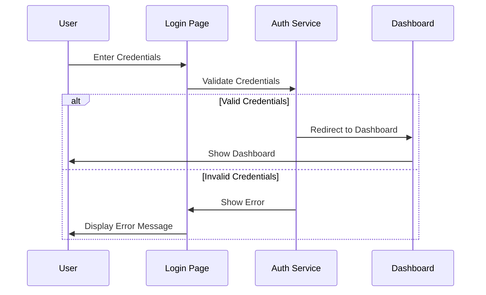
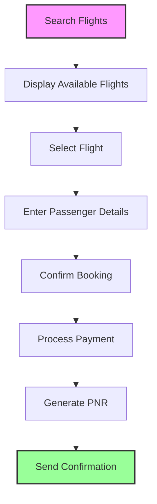
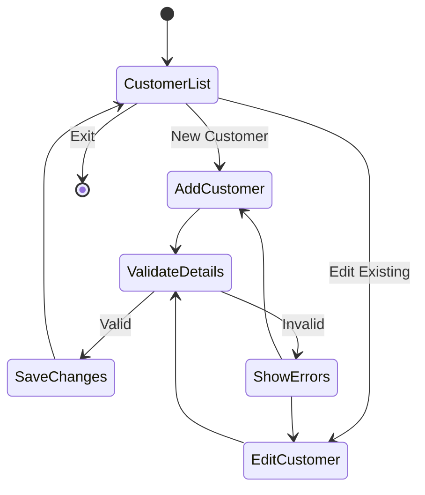

# Web Integration Documentation

## Overview
While the Airline Management System is primarily a desktop application, it includes several web-related components and features. This document outlines the current web integration points and potential future web expansions.

## Current Web Features

### 1. Resource Loading
The application loads resources from URLs and class paths:

```java
// Image loading from resources
ImageIcon icon = new ImageIcon(ClassLoader.getSystemResource(
    "airlinemanagementsystem/icons/front.jpg"
));

// Database connection using URL
String dbUrl = "jdbc:mysql://localhost:3306/airline";
Connection conn = DriverManager.getConnection(dbUrl);
```

### 2. Database Connectivity
JDBC-based web database connection:

```java
public class ConnDB {
    public ConnDB() {
        try {
            // Web database connection
            Class.forName("com.mysql.cj.jdbc.Driver");
            String url = "jdbc:mysql://localhost:3306/airline";
            Connection conn = DriverManager.getConnection(url);
        } catch (Exception e) {
            e.printStackTrace();
        }
    }
}
```

## Future Web Integration Plans

### 1. Web-Based Interface

#### Login Page
```html
<!DOCTYPE html>
<html>
<head>
    <title>Airline Management System - Login</title>
</head>
<body>
    <form action="/login" method="post">
        <input type="text" name="username" placeholder="Username">
        <input type="password" name="password" placeholder="Password">
        <button type="submit">Login</button>
    </form>
</body>
</html>
```

#### Dashboard Page
```html
<!DOCTYPE html>
<html>
<head>
    <title>AMS Dashboard</title>
</head>
<body>
    <nav>
        <a href="/flights">Flights</a>
        <a href="/bookings">Bookings</a>
        <a href="/customers">Customers</a>
    </nav>
    <!-- Dashboard content -->
</body>
</html>
```

### 2. RESTful API Endpoints

#### Authentication
```javascript
// Login endpoint
POST /api/auth/login
{
    "username": "string",
    "password": "string"
}

// Response
{
    "token": "jwt_token",
    "user": {
        "id": "string",
        "username": "string",
        "role": "string"
    }
}
```

#### Customer Management
```javascript
// Create customer
POST /api/customers
{
    "name": "string",
    "aadhar": "string",
    "nationality": "string",
    "phone": "string",
    "address": "string",
    "gender": "string"
}

// Get customer
GET /api/customers/{aadhar}

// Update customer
PUT /api/customers/{aadhar}

// Delete customer
DELETE /api/customers/{aadhar}
```

#### Flight Operations
```javascript
// Search flights
GET /api/flights?source={source}&destination={dest}&date={date}

// Book flight
POST /api/bookings
{
    "aadhar": "string",
    "flightCode": "string",
    "date": "string"
}

// Cancel booking
DELETE /api/bookings/{pnr}
```

### 3. Web Security

#### Authentication
```javascript
// JWT Authentication
const authenticate = async (req, res, next) => {
    const token = req.headers.authorization;
    if (!token) {
        return res.status(401).json({ error: 'No token provided' });
    }
    try {
        const decoded = jwt.verify(token, process.env.JWT_SECRET);
        req.user = decoded;
        next();
    } catch (error) {
        res.status(401).json({ error: 'Invalid token' });
    }
};
```

#### Data Validation
```javascript
// Input validation middleware
const validateBooking = (req, res, next) => {
    const { aadhar, flightCode, date } = req.body;
    if (!aadhar || !flightCode || !date) {
        return res.status(400).json({
            error: 'Missing required fields'
        });
    }
    next();
};
```

## Navigation Flow

### 1. User Authentication Flow

```mermaid
sequenceDiagram
    participant U as User
    participant L as Login Page
    participant A as Auth Service
    participant D as Dashboard
    
    U->>L: Enter Credentials
    L->>A: Validate Credentials
    alt Valid Credentials
        A->>D: Redirect to Dashboard
        D->>U: Show Dashboard
    else Invalid Credentials
        A->>L: Show Error
        L->>U: Display Error Message
    end
```

### 2. Booking Flow

```mermaid
flowchart TD
    A[Search Flights] --> B[Display Available Flights]
    B --> C[Select Flight]
    C --> D[Enter Passenger Details]
    D --> E[Confirm Booking]
    E --> F[Process Payment]
    F --> G[Generate PNR]
    G --> H[Send Confirmation]
    
    style A fill:#f9f,stroke:#333,stroke-width:2px
    style H fill:#9f9,stroke:#333,stroke-width:2px
```

### 3. Customer Management Flow

```mermaid
stateDiagram-v2
    [*] --> CustomerList
    CustomerList --> AddCustomer: New Customer
    CustomerList --> EditCustomer: Edit Existing
    AddCustomer --> ValidateDetails
    EditCustomer --> ValidateDetails
    ValidateDetails --> SaveChanges: Valid
    ValidateDetails --> ShowErrors: Invalid
    ShowErrors --> AddCustomer
    ShowErrors --> EditCustomer
    SaveChanges --> CustomerList
    CustomerList --> [*]: Exit
```

## Integration Components

### 1. API Client
```javascript
class APIClient {
    async login(username, password) {
        const response = await fetch('/api/auth/login', {
            method: 'POST',
            body: JSON.stringify({ username, password })
        });
        return response.json();
    }
    
    async getFlights(params) {
        const response = await fetch('/api/flights?' + 
            new URLSearchParams(params));
        return response.json();
    }
}
```

### 2. Data Models
```typescript
interface Customer {
    aadhar: string;
    name: string;
    nationality: string;
    phone: string;
    address: string;
    gender: string;
}

interface Booking {
    pnr: string;
    aadhar: string;
    flightCode: string;
    date: string;
    status: string;
}
```

## Terms and Definitions

### Web Components
- **API**: Application Programming Interface
- **REST**: Representational State Transfer
- **JWT**: JSON Web Token
- **Endpoint**: URL path for API access

### HTTP Methods
- **GET**: Retrieve data
- **POST**: Create new data
- **PUT**: Update existing data
- **DELETE**: Remove data

### Security Terms
- **Authentication**: Verify user identity
- **Authorization**: Check user permissions
- **Token**: Security credential
- **Validation**: Input checking

### Integration Terms
- **CORS**: Cross-Origin Resource Sharing
- **JSON**: Data format
- **URL**: Web address
- **HTTP**: Web protocol
